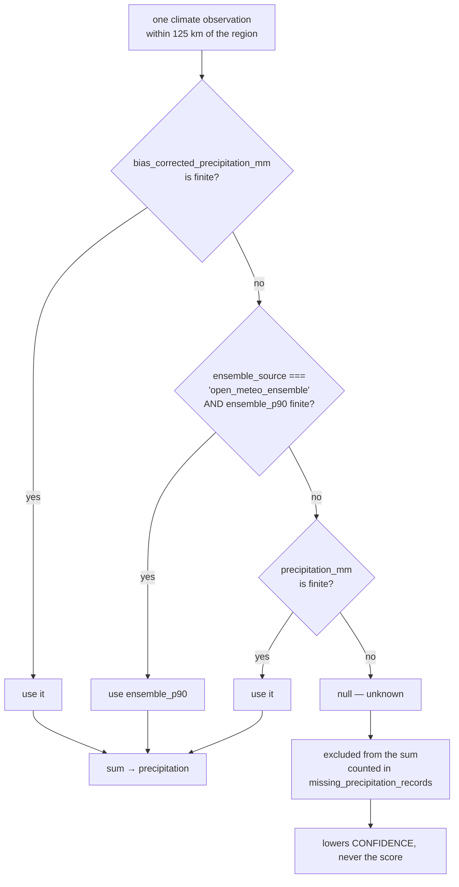
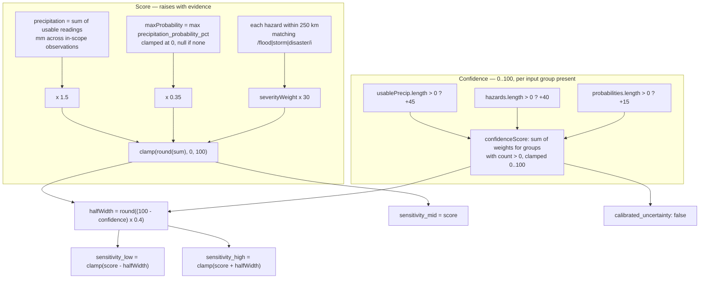
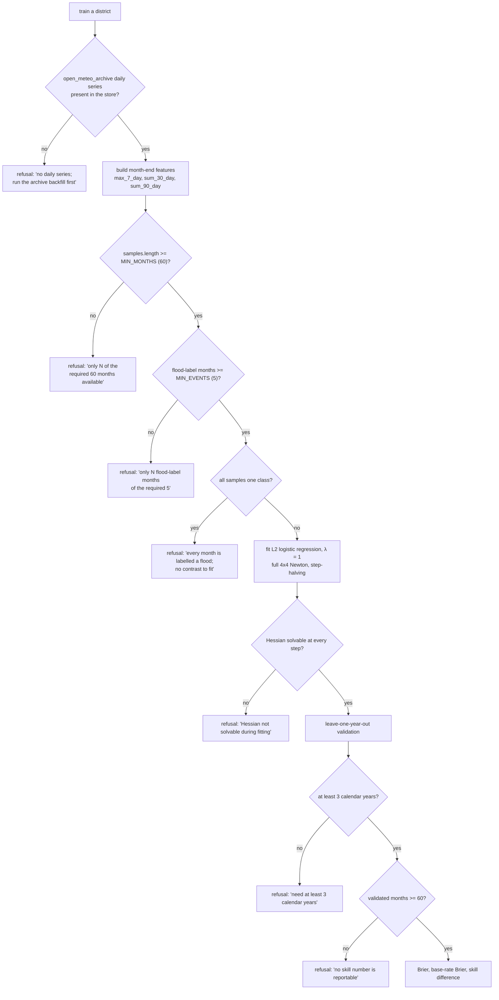
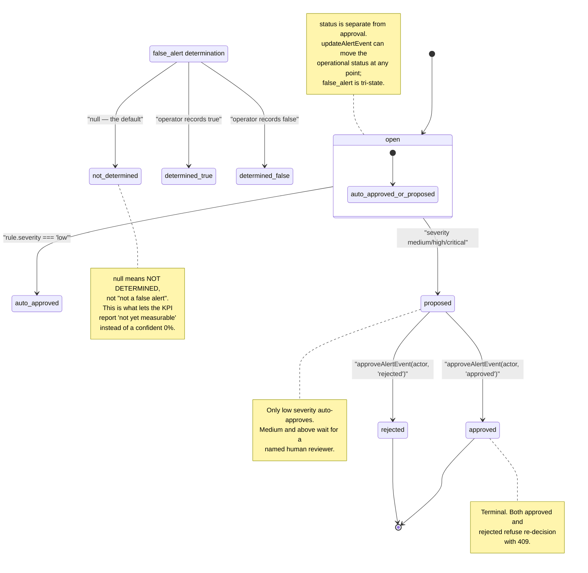

# Analytics and alerts

How stored records become a risk number, and how a risk number becomes an alert a
duty officer may act on.

This is the document where a wrong number becomes a wrong decision about real people,
so most of the length below is spent on what the numbers are **not**. Three of them
are not what their names suggest:

| A reader might assume | The code does |
|---|---|
| `sensitivity_low/mid/high` are a predictive distribution | A fixed function of input coverage. `sensitivity_mid` **is** the score; the width says how many inputs arrived. |
| `brier_score` is a computed skill statistic | `null`, unconditionally. There is no ground truth to score against. |
| `recall` in a trigger backtest differs from `precision` | They are arithmetically identical. See [the backtest](#backtest) below. |

## Region scoping

`collectRegions` (`src/analytics.js:376`) derives the analytical surface from records
that carry coordinates. It used to take *every* such record, so a live GDACS pull
defined the surface: after one, the console computed risk for **87 regions across 25
countries, 82 of them outside the operating area** (`src/analytics.js:344`). The risk
surface then said nothing about the five pilot districts, because it was 94% other
places.

Regions are now bounded to `RISK_SCOPE` (`src/analytics.js:361`):

```
latitude  −6 … 15   ± 6° margin   →  −12 … 21
longitude 27 … 52   ± 6° margin   →   21 … 58
```

Records outside the box are still ingested, still stored, and still drawn on the map.
They simply generate no risk scores. `options.scope` overrides the box; there is no
other way to widen it.

Regions are keyed by `` `${country}:${round(lat)}:${round(lon)}` `` — a **1-degree
grid cell**, first point wins. Two records 40 km apart in different cells become two
regions. One district spanning a cell boundary becomes two.

## Flood risk: `computeFloodRisk`

### Selecting the precipitation input

Each in-scope climate observation is reduced to one number by a strict precedence
chain. The order matters and has changed twice.



**Why `null` and not `0`.** A missing reading is *unknown*, not *measured dry*. The
code comment records the exact regression this replaced: `|| 0` made an absent
precipitation record look like a measured dry spell, which *lowers* the score. For an
absent input that is the worst possible direction — the region looks safer than the
evidence supports. `null` propagates to `drivers.missing_precipitation_records`, into
the confidence denominator, and into the `limits` prose, and never into the score.

**Why `ensemble_source` is checked.** The scorer used to prefer `ensemble_p90` over
the point value. Those percentiles were *synthesized from the same point value* by an
invented spread, so preferring them meant scoring against an inflated number — at a
reported probability of 10%, p90 was about **1.9× the observed precipitation**
(`src/analytics.js:45`). A percentile is now preferred only when a real probabilistic
forecast supplied it, which is what `ensemble_source === 'open_meteo_ensemble'`
asserts.

The same rule governs `hasEnsemble`, which sets `drivers.ensemble_used`. Synthesized
percentiles would otherwise always satisfy it and report uncertainty the data does not
have.

### Composition



`severityWeight` (`src/schema.js:194`): `critical 1`, `high 0.78`, `medium 0.52`,
`low 0.25`, `unknown 0.18`.

Exact constants: climate radius **125 km**, hazard radius **250 km**, hazard filter
`/flood|storm|disaster/i`, precipitation weight **1.5**, probability weight **0.35**,
per-hazard weight **30**, half-width factor **0.4**.

### Confidence counts what was *used*, not what was present

`confidenceScore` (`src/analytics.js:425`) adds a group's weight **only if
`count > 0`**. The three groups are usable precipitation (45), hazards (40), and
probabilities (15) — they sum to 100, so confidence is 100 only when all three are
present, and it degrades in discrete steps of roughly 15–45 points, not continuously.

A region whose observations arrived without precipitation gets a lower confidence, so
an absent input lowers *how sure the score is* rather than lowering the score. That is
the only safe direction for missing data.

Note the consequence: **a genuinely quiet region with no hazards scores lower
confidence than a stormy one.** Confidence measures input coverage, not accuracy. A
low confidence is not a request for more scrutiny in proportion to the risk.

### The sensitivity band is not a predictive interval

`halfWidth = round((100 - confidence) * 0.4)` — a fixed function of confidence width,
nothing else. It does not widen with any physical uncertainty in the input.

These fields were named `score_p10/p50/p50/p90`, which reads as quantiles of a
calibrated predictive distribution. They are not, and the rename was the fix. The
old names remain as aliases (`src/analytics.js:131`) so existing consumers and stored
records keep working — **so a consumer reading `score_p90` is reading a number the
code has explicitly disowned.**

`score_p50 === score` always. `interval_width === 0` therefore means *inputs were
sufficient*, which presents as "no uncertainty" when it means something else entirely.
Every record carries `calibrated_uncertainty: false` and a prose `limits` field saying
so at the point of display.

A high-confidence score of 40 and a low-confidence score of 40 have the same score and
different bands. The band is the only place the input coverage is visible in the
record's headline fields.

### Precipitation probability

Same rule as precipitation: an absent forecast is not a 0% chance of rain
(`src/analytics.js:70`). `maxProbability` is `null` when no reading carried one, and
the score uses `(maxProbability ?? 0)` — so probability contributes **zero** when
absent, which *does* lower the score. This is the one place an absent input reduces
the score rather than the confidence, and it is a deliberate asymmetry: the
precipitation term is a magnitude the score is dominated by (weight 1.5 per mm, so
50 mm alone is 75 points), while probability is capped at 100 × 0.35 = 35 points of
adjustment. `drivers.precipitation_probability_pct` reports the `null` faithfully.

## Climate-conflict risk: `computeClimateConflictRisk`

A second, independent scorer with different radii, different weights, and different
caps (`src/analytics.js:153`).

| Term | Radius | Formula | Cap |
|---|---|---|---|
| `climatePressure` | 125 km | Σ `precipitation_mm \|\| 0` | 35 |
| `hazardPressure` | 250 km | Σ `severityWeight × 12`, **all** hazard types | 25 |
| `conflictPressure` | 125 km | Σ `(4 + fatalities × 0.8)` | 30 |
| `servicePressure` | 75 km | `serviceAssets.length × 1.5` | 10 |

Score is the sum, rounded and clamped 0–100. The four caps sum to exactly 100, so
the score saturates only when every term is at its cap.

Three things differ from the flood scorer and matter:

- **`precipitation_mm || 0`** here. The safe-null rule from `computeFloodRisk` is
  **not** applied in this scorer, and `||` will also coerce a legitimate `0` to `0`
  (harmless) but a missing reading to `0` (not harmless). This is the same class of
  defect the flood scorer fixed and did not get fixed here. The exposure is bounded
  by the 35-point cap and by `|0|` contributing nothing, so the direction is
  under-scoring on incomplete input — but it is inconsistent with the stated policy.
- **Every hazard counts**, not just `/flood|storm|disaster/i`. An earthquake is a
  `hazard_event` and contributes here.
- **Conflicts contribute a flat 4 points each before fatalities.** Any conflict event
  within 125 km — including a fatalty-free protest or a border incident — moves the
  score. ACLED events are user-supplied and licence-gated on a request boolean.

Confidence weights are also different: climate 30, hazards 25, conflicts 30,
services 15. Same band construction, same `calibrated_uncertainty: false`.

The identical band bug exists here and the comment at `src/analytics.js:172` defers to
the flood scorer's explanation rather than repeating it.

## Service impacts: `computeServiceImpacts`

For each `service_assets` record (`src/analytics.js:212`):

- `nearestFlood` / `nearestConflict` — nearest risk score **of that type**, by
  haversine, over *all* regions regardless of confidence or score.
- `floodScore` — the nearest flood risk's `score`, **or 0** if it is further than
  150 km. Same for conflict. Beyond 150 km the contribution is zero, not the risk of
  the nearest region scaled down.
- `impact_score = clamp(round(floodScore × 0.55 + conflictScore × 0.45), 0, 100)`.
- `confidence = round(nearestFlood.confidence × 0.55 + nearestConflict.confidence × 0.45)`,
  with `|| 0` for a missing side.

So a service asset with no conflict risk anywhere scores `0.45 × floodScore` — the
0.45 weight applies to an absent input as a zero rather than being redistributed.
Same asymmetry as above, same bounded exposure.

`recommendedActions` maps score bands to fixed advice (`src/analytics.js:415`):
≥80 activate continuity plan; ≥60 monitor and confirm backup providers; ≥35 routine
monitoring; else no action. Note the threshold 35 is the same cut as `riskLevel`'s
`medium`, so action sets and risk levels align.

There is **no** per-asset exposure model. No flood depth, no road accessibility, no
population weighting is applied here; those live in separate `impact.js` /
`road-access.js` paths.

## Data quality: `computeDataQuality`

Grouped by `record.source` (falling back to `operator`), then merged with
`source_runs` so a source that has only ever failed still appears
(`src/analytics.js:308`).

```
confidence = clamp(round(
    geocodeCoverage × 55                       // share of records with finite lat/lon
  + min(total_records, 25) × 1.8              // saturates at 25 records
  - runPenalty - freshnessPenalty), 0, 100)
```

- `runPenalty` = 35 if the last run `failed`, 15 if `degraded`, else 0.
- `freshnessPenalty` (`src/analytics.js:442`): no date at all → **30**; ≤ 2 days → 0;
  ≤ 14 days → 10; ≤ 45 days → 20; beyond → 30. A future date → 0, on the grounds
  that a clock is wrong rather than that the data is wrong.

`freshnessLabel` uses the same boundaries and names them `unknown` / `current` /
`recent` / `stale` / `expired`.

Two properties worth stating plainly. **A source with zero records scores higher than
one with ten**, because `geocodeCoverage` of an empty set is defined as `0`, but
`min(0, 25) × 1.8 = 0` and `freshnessPenalty` for no date is only 30 — so an unknown
source lands around 0 after the penalty, but one whose last run succeeded and which has
some records is compared against a source that failed.

**Fixed 2026-10-03.** `mean_confidence` was computed from `quality.confidence_sum`,
which was initialised and read but **never incremented** anywhere in the function —
so it divided zero by the record count and reported `0` for every source in the
platform, including sources whose model produced perfectly good confidences. A
data-quality panel showed "mean confidence 0" beside a source with thousands of
records and a healthy run. It now sums only the records that carry a confidence,
divides by `confidence_count` rather than by the record total, and returns `null`
when nothing carried one: raw source rows have no model confidence, and averaging
their absence in would understate the sources that do. `confidence_sum` and
`confidence_count` are both in the payload, so a reader can check the mean.
A companion `mean_confidence_pct` is emitted alongside, because the 0-1 fraction
sits confusingly next to `confidence` and `geocode_coverage_pct`, which are 0-100.

Note the rounding that hid this: `Math.round(0.82)` is `1`. A 0-1 mean rounded to
an integer can only ever be 0 or 1, so even a correctly-summed value would have
been meaningless. The same defect was in `calibrationReport`'s `mean_confidence`
and `mean_interval_width`; both are now two-decimal and null-safe too.

## Calibration report: `brier_score` is always `null`

`calibrationReport` (`src/analytics.js:246`) groups `risk_scores` by `type` and
returns `mean_score`, `mean_confidence`, `mean_interval_width`, and:

```js
brier_score: null,
```

Unconditionally, as a literal. This is not a computation that failed; it is not
computed at all. There is no labelled outcome set to score against — the platform has
no record of which past hazard *did* or *did not* occur for a scored region, which is
the same reporting-coverage problem that bounds the flood-probability model.

A Brier score of `null` correctly says "not measurable". It is worth stating that
`mean_interval_width` in the same object is likewise a mean of the sensitivity band
width, which as established above carries no probabilistic meaning.

## Flood probability

`src/flood-probability.js`. This is the most capable thing in the repository and the
most restricted, and the restriction is deliberate.

**Scope: empirical co-occurrence, not hydrology.** The model estimates

> P( a GDACS-reported flood within 150 km of the district point starting in a
> calendar month | that month's rainfall statistics )

It is conditioned on *reporting coverage as much as on hydrology*. Every model card
carries the field `what_a_probability_is_not` (`src/flood-probability.js:72`):

> reporting-conditioned: P(flood enters the GDACS archive), not P(water reaches a
> given ground elevation)

`docs/flood-probability-model-basis.md` records the operator decision, the rejected
alternatives, and the residual limitations in full.

### Hard refusals



At **scoring** time, `predict` (`src/flood-probability.js:521`) returns `null` if any
feature is non-finite — same-window refusal, not a default value.

The refusal gates are **part of the model, not error messages**. The basis document
states the reason plainly: "coefficients that look authoritative without a sample are
the specific failure this gate exists to prevent."

### The measured ceiling on the pilot districts

`docs/flood-probability-model-basis.md:105` records a full 1985–2026 walk of the
GDACS archive. It retains **93 Sub-Saharan flood events**. Matched at 150 km against
the three pilot districts, that is:

| District | Flood-label months, 1985–2026 | Required |
|---|---|---|
| Turkana | 1 | 5 |
| Mogadishu | 2 | 5 |
| Juba | 0 | 5 |

**All three pilot districts refuse at the `MIN_EVENTS` floor. This is the expected
outcome, not a temporary data gap** — with this archive and this radius it is the
ceiling. A trained number for these districts needs a denser flood signal, which is an
operator decision, not a code default.

An operator who runs the training endpoint and sees three refusals is seeing the model
working.

## Alerts

### Rules

`normalizeAlertRule` (`src/alerts.js:7`). A rule is `{ metric, operator, threshold,
severity, scope, actions, suppression_minutes }`. Operators are `>`, `>=`, `<`, `<=`,
`==`, `!=`; severity falls back to `medium` for anything unrecognised; suppression
defaults to 120 minutes.

### Evaluation

`evaluateAlertRules` (`src/alerts.js:98`):

1. Only rules with `status === 'active'` are considered. Archived and draft rules
   cannot fire.
2. `resolveMetric(context, rule.metric)` walks a **dot path** against the context
   object (`src/alerts.js:213`): `"risk_scores.flood_risk.score"`. A missing segment
   yields `undefined`, and `!Number.isFinite(undefined)` skips the rule silently.
3. `suppressionBucket(now, suppression_minutes)` = `floor(now / windowMs)` — a
   **fixed global time grid**, not a per-rule window anchored at first fire. An event
   is suppressed if one with the same `rule_id` and `suppression_bucket` already
   exists.
4. If the bucket is empty, an event is created with `status: 'open'` and
   `approval: { state: rule.severity === 'low' ? 'auto_approved' : 'proposed' }`.

The event `id` is `stableId('alert', [rule.id, bucket, value])` — it includes the
observed `value`, so the same rule crossing the same bucket twice at different values
produces different ids. The suppression check is on `rule_id` + bucket, so the second
one is still suppressed; the id difference is cosmetic.

### Event lifecycle



`updateAlertEvent` (`src/alerts.js:34`) is independent of the approval gate: it sets
the operational `status`, `owner`, `resolution_note`, and `false_alert`. An event can
be resolved without ever having been approved, and approved without being resolved.

`approveAlertEvent` (`src/alerts.js:76`) records `reviewer`, `reviewed_at`, and
`decision_note`. It **rejects any second decision** with 409 — an approval is
terminal and cannot be revoked in place.

### `false_alert` is tri-state, and that distinction is load-bearing

`false_alert` is `true` / `false` / `null`, where **`null` means "not determined"**,
not "determined to be false". `determination()` (`src/alerts.js:65`) accepts `true`,
`false`, the strings `'true'`/`'false'`, and `null` / `undefined` / `''` (→ `null`).
Anything else **throws** rather than coercing — a value like the string `"maybe"`
must not silently become `false`, "which would understate the false-alert rate and
flatter the system."

The reason it is a field and not prose: the KPI used to scan `resolution_note` for
`/false|invalid|noop/i` and divide by alert count. On the seeded data that returned
**0%**, which reads as "no false alerts occurred" when it means "nobody happened to
write the word false." None of the real resolutions — "situation stabilised",
"temperature normalised" — says whether the alert was warranted at all.

So the tri-state is the difference between a measurable KPI and an unmeasurable one.
Denominators must be *determined* alerts, not all alerts.

### Trigger protocols

`normalizeTriggerProtocol` (`src/alerts.js:132`) adds `mode` (`shadow` | `live`),
`lead_time_days` (default 3), `rule_ids`, `action_playbook`, `approvers`, `version`,
and `backtest`.

`evaluateInShadowMode` (`src/alerts.js:202`) resolves the metric and reports
`would_fire` and the computed value, and **creates nothing**. This is the dry-run
path: a protocol can be observed against live context for as long as an operator
wants without producing an alert event or touching the approval queue.

### Backtest

`backtestTriggerProtocol` (`src/alerts.js:163`) walks `source_runs`; for each run it
counts hazard events occurring in `(run.completed_at, run.completed_at + lead_time]`.
More than one → true positive; zero → false positive.

**Known defect: `misses` is identically zero, so `recall` equals `precision`.**

```js
if (matchedEvents.length > 0) { truePositives++ } else { falsePositives++ }
...
misses = samples - truePositives - falsePositives   // always 0
```

Every sample increments exactly one of `truePositives` or `falsePositives`, so the
three always sum to `samples` and `misses` is always `0`. The metric is not computed
wrong — it is not a metric. The consequence is not subtle:

```
recall   = truePositives / (truePositives + 0)     = TP / samples
precision = truePositives / (truePositives + FP)  = TP / samples
```

because every sample is classified. The two are the same number, always, to three
decimal places. A backtest reporting `recall: 0.87, precision: 0.87` is not evidence
that the protocol is well-tuned; it is the arithmetic signature of a loop that has no
branch for "should have fired and did not."

The root cause is the loop definition. This is a **precision-only evaluation**: it
measures "of the runs at which the protocol would have fired, how often did a hazard
actually follow." A recall evaluation needs the complement — a window in which
nothing happened *and* the protocol would have fired had it been live. Whether that
is intended or an oversight is not stated anywhere in the code.

Note also that `samples` counts source runs, not regions or alert candidates. A
protocol scoped to one district is evaluated against every run of every source
worldwide, since the `hazardEvents.filter` at `src/alerts.js:178` applies **no
geographic or scope filter** — `protocol.scope` is stored on the protocol and never
read by the backtest.

## Unresolved

- Whether `misses === 0` is a deliberate "precision-only" framing or an oversight.
  Either way `recall` in a backtest response is not a recall.
- `backtestTriggerProtocol` ignores `protocol.scope` entirely, so a district-scoped
  protocol is scored against global hazard events.
- `computeClimateConflictRisk` and `computeServiceImpacts` both use `|| 0` / `?? 0`
  on optional inputs, where `computeFloodRisk` uses `null` and routes absence to
  confidence. Whether the flood scorer's policy is intended to apply to the other two
  is not stated.
- ~~`confidence_sum` in `computeDataQuality` is initialised and read but never
  incremented, so `mean_confidence` is always `0`. No comment marks this as
  deliberate.~~ **Fixed 2026-10-03** — see above; the accumulator is now
  incremented, divided by the count of records that carry a confidence, and null
  when there are none.
- `evaluateAlertRules` skips a rule whose metric resolves to `undefined` with no
  diagnostic. A typo in a metric path is indistinguishable from a rule that
  correctly did not fire.
