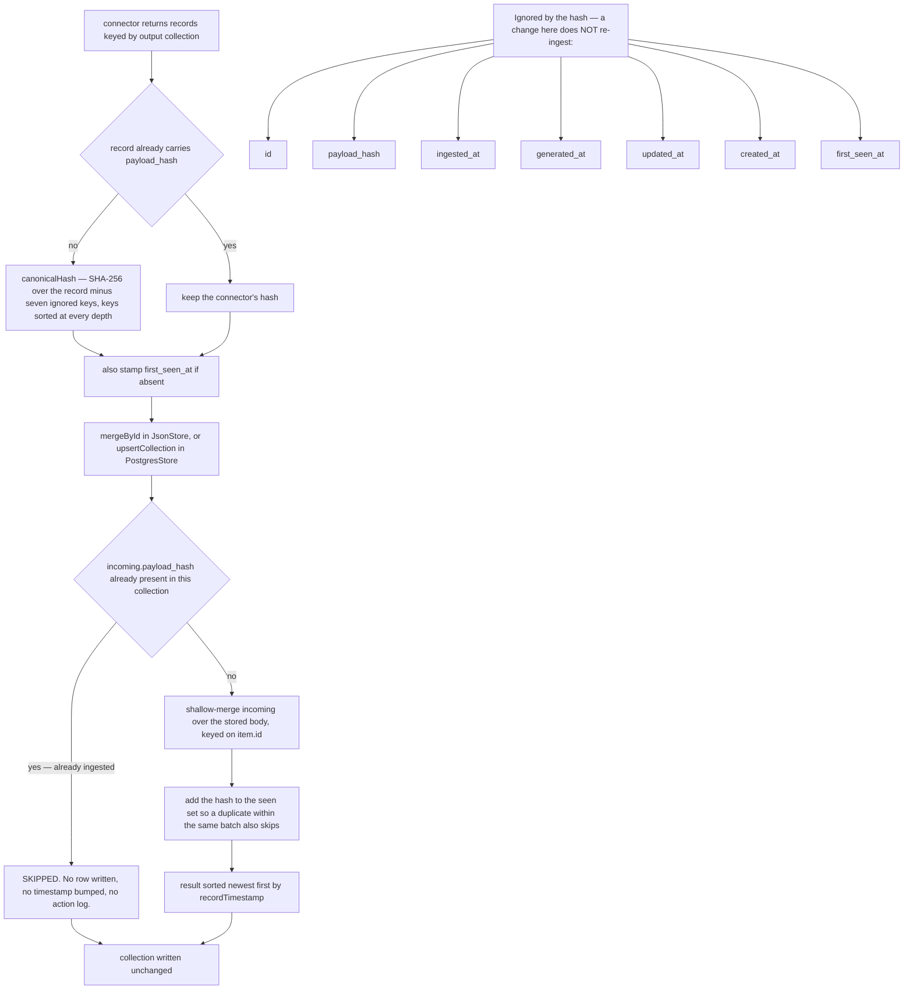
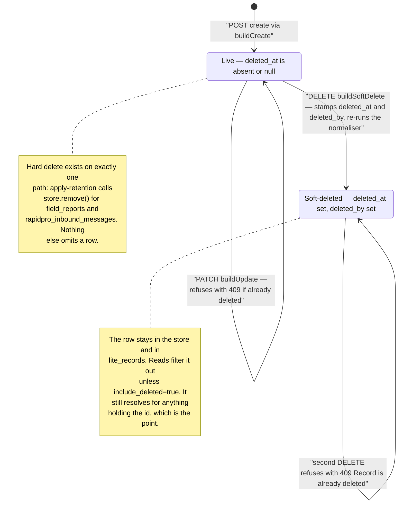

# Data model

Lindela Lite stores 39 named collections of JSON documents. There is no schema,
no migration, no join, and no foreign key. What holds the shape together is a
39-entry array that every write path iterates over, and a `stableId` convention
that makes record identity content-derived.

Related: [ingestion.md](ingestion.md) for how connectors produce these records,
[analytics-and-alerts.md](analytics-and-alerts.md) for the derived collections,
[request-lifecycle.md](request-lifecycle.md) for the write path.

## Two lists that must agree

There are two enumerations of the collections, and nothing enforces that they
are the same set.

- `COLLECTIONS` (`src/store.js:6`) — 39 strings, plus the comment below it.
- `emptyStore()` (`src/schema.js:211`) — the same 39 names as `[]` arrays, plus
  `version: 1` and `updated_at`.

`JsonStore.merge` and both `PostgresStore` write paths iterate `COLLECTIONS`
strictly. A collection present in `emptyStore()` but missing from `COLLECTIONS`
would be accepted into the store object and then never written. The comment at
`src/store.js:43-46` records that this is not hypothetical: it is the same class
of bug the ingestion merged map had, caught by a food-security API test.

```js
// Every collection JsonStore.merge writes must be listed here: the loop
// below keys strictly off COLLECTIONS, and an unlisted collection's records
// are dropped silently — the same class of bug the runIngestion merged map
// had, caught first by the food-security API test.
```

**The current test coverage guards `emptyStore()`, not `COLLECTIONS`.** Three
tests assert that `emptyStore()` declares a collection
(`test/lite.test.js:5452`, `:5512`, `:5932`) — `food_security_records`,
`disease_observations`, `flood_probability_models`, each added after its own bug.
No test imports `COLLECTIONS` and asserts the two lists match. Today they do
match as sets; they even differ in declaration order (`data_lineage` sits
between the report collections in one and after them in the other), which is
harmless because nothing indexes by position. A future collection added to one
list and not the other reintroduces the silent drop with nothing to catch it.

## Physical storage

PostgreSQL is one table, not 39 (`src/postgres-store.js:22-56`):

```sql
CREATE TABLE lite_records (
  collection TEXT NOT NULL,
  id         TEXT NOT NULL,
  body       JSONB NOT NULL,
  updated_at TIMESTAMPTZ NOT NULL DEFAULT now(),
  PRIMARY KEY (collection, id)
);
ALTER TABLE lite_records ADD COLUMN IF NOT EXISTS payload_hash TEXT;
```

Two indexes: `(collection, updated_at DESC)` for reads, and a partial
`(collection, payload_hash) WHERE payload_hash IS NOT NULL` for the dedupe
lookup. The `payload_hash` column exists so dedupe does not require loading every
body; the code notes the backfill used `jsonb_exists()` rather than the `?`
operator, which is ambiguous with parameter placeholders in the extended query
protocol.

The alternative backend is a single pretty-printed JSON file
(`JsonStore`, default `data/lindela-lite-store.json`). Both present the same
interface — `read`, `write`, `merge`, `replaceAnalytics` — and the server cannot
tell which it holds.

## The domains

An `erDiagram` grouping the 39 collections. Read it as a partition of the one
table, not as a relational schema: `LITE_RECORDS` is the only real entity, and
each domain box is the set of rows whose `collection` column is one of the names
listed inside it. The dashed edges are parent/child intentions expressed as bare
id fields — nothing validates them.

```mermaid
erDiagram
  LITE_RECORDS {
    text collection "PK"
    text id "PK"
    jsonb body "the whole document"
    timestamptz updated_at "row write time"
    text payload_hash "dedupe key, nullable"
  }

  INGEST_PROVENANCE {
    text source_runs "per-source run outcome"
    text ingestion_schedules "recurrence config"
    text data_lineage "checksums per run"
    text data_quality "derived, per source"
  }

  HAZARD_ENVIRONMENT {
    text climate_observations "connector output"
    text hazard_events "connector output"
    text conflict_events "operator upload"
    text flood_probability_models "derived, trained"
  }

  FOOD_SECURITY {
    text food_security_records "IPC phases"
  }

  HEALTH_SURVEILLANCE {
    text disease_observations "WHO GHO indicators"
  }

  ASSETS_EXPOSURE {
    text service_assets "operator upload"
    text population_at_risk "derived"
    text facilities_at_risk "derived"
  }

  OPERATIONS {
    text incidents "soft-delete"
    text interventions "soft-delete"
    text intervention_tasks "soft-delete"
    text field_reports "soft-delete"
    text response_resources "soft-delete"
    text action_logs "read-only"
    text community_feedback "hashed reporter URN"
  }

  ALERTING_DISPATCH {
    text alert_rules "configured"
    text alert_events "raised"
    text trigger_protocols "pre-agreed"
    text events_outbox "pending delivery"
    text webhook_subscriptions "configured"
    text rapidpro_dispatches "outbound"
    text rapidpro_inbound_messages "inbound"
  }

  REPORTING {
    text report_templates "versioned on update"
    text reports "generated documents"
    text report_distribution_runs "per channel"
    text report_schedules "recurrence config"
    text report_schedule_runs "execution log"
  }

  WORKFLOW {
    text workflow_instances "typed state machine"
  }

  PARAMETRIC {
    text parametric_rules "testnet chains only"
    text parametric_disbursements "simulation results"
  }

  ANALYTICS_KPI {
    text risk_scores "sensitivity band, not a quantile"
    text impact_assessments "derived per asset"
    text road_access "derived per road"
    text kpi_snapshots "derived monthly"
  }

  LITE_RECORDS ||--o{ INGEST_PROVENANCE : "rows where collection is one of these"
  LITE_RECORDS ||--o{ HAZARD_ENVIRONMENT : "rows where collection is one of these"
  LITE_RECORDS ||--o{ FOOD_SECURITY : "rows where collection is food_security_records"
  LITE_RECORDS ||--o{ HEALTH_SURVEILLANCE : "rows where collection is disease_observations"
  LITE_RECORDS ||--o{ ASSETS_EXPOSURE : "rows where collection is one of these"
  LITE_RECORDS ||--o{ OPERATIONS : "rows where collection is one of these"
  LITE_RECORDS ||--o{ ALERTING_DISPATCH : "rows where collection is one of these"
  LITE_RECORDS ||--o{ REPORTING : "rows where collection is one of these"
  LITE_RECORDS ||--o{ WORKFLOW : "rows where collection is workflow_instances"
  LITE_RECORDS ||--o{ PARAMETRIC : "rows where collection is one of these"
  LITE_RECORDS ||--o{ ANALYTICS_KPI : "rows where collection is one of these"

  OPERATIONS o|--o{ OPERATIONS : "incident_id, intervention_id — bare ids, not enforced"
  OPERATIONS }o--o| ALERTING_DISPATCH : "community_feedback.alert_event_id — bare id"
  OPERATIONS o|--o{ ALERTING_DISPATCH : "field_reports may carry an alert_event_id"
  REPORTING o|--o{ REPORTING : "template_id, schedule_id, report_id — bare ids"
  ALERTING_DISPATCH o|--o{ WORKFLOW : "workflow_instances.subject_id — bare id"
  ALERTING_DISPATCH ||--o{ ANALYTICS_KPI : "risk_scores.id is referenced as incident.risk_score_id"
```



**What is not modelled, stated plainly:**

- No foreign key is enforced anywhere. `interventions.incident_id` is a string.
  Deleting an incident does not touch its interventions; the intervention keeps a
  dangling reference that still resolves for display, because soft delete keeps
  the row.
- No join is ever performed in the database. Every cross-collection query is a
  JavaScript `.find()` over an in-memory array, which is why the whole store is
  read once per request.
- No index exists on any id field except the primary key. `intervention_id` is
  looked up by scanning.
- No column, type, or nullability constraint is declared on `body`. A record
  that fails validation can still be stored by a path that bypasses the
  normaliser.
- Referential intent survives only in normaliser code: `normalizeTask` requires
  `intervention_id` and looks the parent up to inherit `incident_id`;
  `normalizeIntervention` requires `incident_id`. Those are the only places a
  dangling reference is refused at write time.

## Key fields by domain

Every collection carries `id`, and most carry `created_at`/`updated_at` and a
free-form `metadata`. What follows is the distinguishing shape, read from each
`normalize*` function or the connector that produces it.

### Ingest and provenance

| Collection | Key fields |
|---|---|
| `source_runs` | `source`, `status` (`success`/`degraded`/`failed`), `run_type`, `schedule_id`, `started_at`, `completed_at`, `records_processed`, `records_by_collection`, `errors[]`, `diagnostics` (attempts, timeout, retries, duration) |
| `ingestion_schedules` | `source`, `status`, `interval_minutes`, `timeout_ms`, `retries`, `stale_after_minutes`, `next_run_at`, `last_run_at`, `default_options`, `owner` — defaults come from the per-source policy in `SOURCE_POLICIES` |
| `data_lineage` | `source`, `source_run_id`, `retrieval_time`, `transform_version`, `record_count`, `payload_hashes[]`, `upstream_checksum` (hash of the hash list) |
| `data_quality` | `source`, `records_by_collection`, `total_records`, `geocoded_records`, `geocode_coverage_pct`, `latest_record_at`, `last_run_status`, `error_count`, `freshness`, `confidence`, `mean_confidence` — derived, one row per source |

### Hazard and environment

| Collection | Key fields |
|---|---|
| `climate_observations` | `source`, `region_name`, `observed_at`, `latitude`, `longitude`, `precipitation_mm`, `temperature_c`, and for archive/flood sources `series_start`, `series_end`, `series_days`, `days_missing_precipitation`; ensemble sources add `ensemble_source`, `ensemble_p10`/`p50`/`p90` |
| `hazard_events` | `source`, `source_id`, `event_type` (preserved, never rejected — an unknown upstream type is kept), `severity`, `title`, `occurred_at`, `latitude`, `longitude`, `country`, `admin1`, `fatalities` |
| `conflict_events` | `source`, `event_date`, `event_type`, `severity` (derived from `fatalities` when present), `title`, `latitude`, `longitude`, `country`, `admin1` — from the operator's own CSV or an ACLED-licensed upload |
| `flood_probability_models` | `region_name`, `country`, `source` = `flood_probability_train`, `label_source`, `trained_at`, `model` (fitted coefficients), `folds` (leave-one-year-out), `contingency`, `basis` (what a probability here is *not*), `months_kept`, `flood_months`, `rainfall` (provenance of the training series) |

Two of these carry deliberate refusals in their shape. A record whose geometry is
an area rather than a point — IPC classifications, WHO national aggregates —
carries `latitude: null`, `longitude: null` and, where the source published one,
a `bbox`. An area name is not a point; giving it coordinates would let distance
queries attribute it to a district by proximity, which would be wrong.

### Food security and health

| Collection | Key fields |
|---|---|
| `food_security_records` | `source` = `ipc_hdx`, `source_id`, `scope`, `level1`, `area`, `analysis_date`, `validity_period`, `valid_from`, `valid_to`, `total_country_population`, `phases` (per IPC phase: number and fraction), `bbox`, `observed_at` |
| `disease_observations` | `source` = `who_gho`, `indicator` code, `country`/`SpatialDim`, `year`, `value`, `observed_at`, `latitude: null`, `longitude: null` |

`computeDataQuality` treats both as first-class collections for geocode
coverage, which is why an IPC record with null coordinates counts against
`geocoded_records` rather than being excluded.

### Assets and exposure

| Collection | Key fields |
|---|---|
| `service_assets` | `source`, `name`, `service_type` (one of the eight in `SERVICE_TYPES`), `country`, `admin1`, `latitude`, `longitude`, plus for roads `road_class` (one of six), `passability` (`passable`/`restricted`/`impassable`), `width_m` |
| `population_at_risk` | keyed on `hazard_event_id`, with `facilities[]` of nearby `{id, name}`, a `radius_km` gate (default 25) |
| `facilities_at_risk` | aggregated per `service_type`: `at_risk_count`, `high_severity_count` |

`passability` is nullable and expected only where `road_class` is set. Anything
with a road classification is expected to carry one; non-road assets leave it
null. `computeRoadAccess` treats a missing value as unreported, not as passable.

### Operations

The five soft-deletable collections are handled together, because
`buildUpdate` and `buildSoftDelete` share one dispatch across exactly these five
and throw `Unsupported operational collection` for anything else.

| Collection | Key fields |
|---|---|
| `incidents` | `source` (default `operator`), `incident_type`, `title`, `description`, `status` (5-value enum), `severity`, `priority`, `country`, `admin1`, `latitude`, `longitude`, `occurred_at`, `owner`, `linked_event_id`, `risk_score_id`, `service_asset_ids[]`, `tags[]` |
| `interventions` | `incident_id` (required), `title`, `objective`, `status` (5-value enum), `priority` (inherited from the incident), `lead_org`, `partners[]`, `service_asset_ids[]`, `start_at`, `target_end_at`, `completed_at`, `budget_usd`, `success_metrics`, `outcome_summary` |
| `intervention_tasks` | `intervention_id` (required), `incident_id` (inherited), `title`, `status` (5-value enum), `priority` (inherited), `owner`, `due_at`, `completed_at`, `action_type`, `linked_asset_id` |
| `field_reports` | `incident_id` or `intervention_id` (required at create only), `summary`, `reported_by`, `observed_at`, `needs[]`, `impact`, `latitude`, `longitude`, `location_source`, `location_accuracy_m`, `category`, `status`, `source`, `demographics` (age band, gender, `pwd`, `refugee_or_idp`) |
| `response_resources` | `name`, `resource_type`, `status` (`available`/`reserved`/`deployed`/`depleted`), `quantity`, `unit`, `country`, `location_name`, `latitude`, `longitude`, `assigned_intervention_id` |
| `action_logs` | `collection`, `record_id`, `action`, `actor`, `subject`, `summary`, `metadata.status`, `metadata.priority` — read-only through the API (405 on write) |
| `community_feedback` | `alert_event_id`, `source`, `reporter_urn_hash`, `sentiment`, `message`, `was_action_taken` — the reporter URN is hashed on the way in, never stored raw |

Two of these normalisers exist because of specific failures, and the fields they
carry are the fix:

- **A field report must be attributable when created but not re-required later.**
  A report raised through `POST /api/v1/chw/report` has no incident linkage by
  design — a health worker reporting a symptom does not know which incident it
  belongs to. Re-checking the link on every update made such a record impossible
  to update or withdraw, and "a disease signal that cannot be withdrawn is a
  problem when the report turns out to be a duplicate or a mistake."
- **`location_source` and `location_accuracy_m` are carried explicitly.** A
  report with no coordinates has to say why, or "no location" is
  indistinguishable from "we did not look".

### Alerting and dispatch

| Collection | Key fields |
|---|---|
| `alert_rules` | `name`, `status` (`active`/`paused`), `metric`, `operator`, `threshold`, `severity`, `scope`, `actions[]`, `suppression_minutes` |
| `alert_events` | `status` (`open`/`acknowledged`/`resolved`), `owner`, `resolution_note`, `false_alert` |
| `trigger_protocols` | `name`, `version`, `metric`, `operator`, `threshold`, `severity`, `lead_time_days`, `mode`, `rule_ids[]`, `action_playbook[]`, `approvers[]`, `backtest` |
| `events_outbox` | `event`, `payload`, `attempts`, `last_attempt_at`, status flipped to `sent` on success |
| `webhook_subscriptions` | `url` (must be http/https), `events[]` (non-empty glob patterns), `headers`, `secret`, `status` |
| `rapidpro_dispatches` | `provider`, `alert_event_id`, `status`, `mode` (`flow_start`/`broadcast`), `message`, `recipients`, `endpoint`, `request_body`, `response_status`, `response_body`, `error`, `queued_at`, `sent_at`, `matched_signal_id`, `matched_signal_at` |
| `rapidpro_inbound_messages` | `provider`, `source_id`, `direction`, `from`, `contact_uuid`, `contact_name`, `text`, `status`, `alert_event_id`, `dispatch_id`, `payload` |

`false_alert` is the load-bearing field on `alert_events`. It is
`true`/`false`/`null`, and `null` means *not determined* — not "no". The KPI
previously scanned `resolution_note` for `/false|invalid|noop/i` and divided by
the alert count, which returned 0% on the demo data. That reads as "no false
alerts occurred" when it means "nobody happened to write the word false". `null`
is what lets the KPI report "not yet measurable" instead of a confident zero.

An inbound message with no explicit `alert_event_id` is linked to one by scanning
dispatches from the last 24 hours for a recipient match on the sender URN. That
is a heuristic over a window, not a stored foreign key.

### Reporting

| Collection | Key fields |
|---|---|
| `report_templates` | `name`, `report_type` (5-value enum), `status`, `version` (**incremented on every update**), `title_pattern`, `default_filters`, `sections[]`, `distribution_defaults[]`, `schedule_defaults`, `owner` |
| `reports` | `template_id`, `report_type`, `scope`, `title`, `section_ids[]`, `sections[]`, `status` (5-value enum) |
| `report_distribution_runs` | `report_id`, `template_id`, `channel`, `recipients`, `status` (`prepared`/`sent`/`failed`), `payload_summary`, `response_status`, `response_body`, `error`, `retry_of`, `options` |
| `report_schedules` | `template_id` (required), `status`, `timezone`, `recurrence`, `auto_distribute`, `distribution_defaults[]`, `next_run_at`, `last_run_at`, `owner` |
| `report_schedule_runs` | `schedule_id`, `report_id`, `status` (`completed`/`failed`), `started_at`, `completed_at`, `error` |

A report cannot be set to `approved` or `distributed` with no sections.
`normalizeReport` throws 400: a report with no sections renders as a title and
four metadata lines, and an empty SITREP that looks finished to every consumer is
worse than one that was never generated.

Template `version` incrementing on every update means a PATCH is a new template
version, not an in-place edit. Reports reference `template_id`, so the version
history is implied by the ids rather than stored.

### Workflow

| Collection | Key fields |
|---|---|
| `workflow_instances` | `type` (validated against `WORKFLOW_TYPES`), `subject_kind`, `subject_id`, `state` (validated against the per-type state list), `district`, `owner`, `closed_at`, `transitions[]`, `metadata` |

`transitionWorkflow` walks a `WORKFLOW_TRANSITIONS[type]` table and appends to
`transitions`, recording actor and evidence. It is the only collection whose
valid state depends on another field of the same record, which is why the
validation cannot live in the store.

### Parametric

| Collection | Key fields |
|---|---|
| `parametric_rules` | `chain`, `contract_address`, `trigger_metric`, `trigger_threshold`, `disbursement_amount_local_currency`, `currency`, `recipient_group_id`, `status` (`draft`/`active`/`paused`/`archived`) |
| `parametric_disbursements` | the simulation result, including `focal_point_approved` and the sanctions screening outcome |

`normalizeParametricRule` throws 400 for a mainnet chain and again for a chain
outside `PARAMETRIC_CHAINS`. The comment calls it "testnet-only per pilot
commitment" — the refusal is in the normaliser, so it applies to every write path
rather than to a UI.

A simulation with no recipient name returns `blocked: false` with
`reason: 'no recipient name supplied, so no name was screened against the OFAC SDN list'`.
The response says what was *not* checked rather than implying a clean screen.

### Analytics and KPI

All four are derived by `refreshAnalytics` or `refreshKpiSnapshots` and are
replaced wholesale rather than merged.

| Collection | Key fields |
|---|---|
| `risk_scores` | `type` (`flood_risk`/`climate_conflict_risk`), `region_name`, `score`, `risk_level`, `confidence`, `sensitivity_low`/`_mid`/`_high`, `score_p10`/`_p50`/`_p90`, `interval_width`, `drivers` (input counts), `methodology`, `limits` |
| `impact_assessments` | `asset_id`, `asset_name`, `service_type`, `impact_score`, `impact_level`, `confidence`, `generated_at`, `drivers` (nearest risk regions), `recommended_actions` |
| `road_access` | `road_id`, `road_name`, `road_class`, `access_status`, `access_reason`, `access_score`, `access_level`, `reported_passability`, `obstruction_count`, `obstructions[]` (each with `hazard_id`, `distance_km`, `matched_by`, `blocking`), `primary_hazard_id`, `generated_at`, `confidence` |
| `kpi_snapshots` | `month`, `from`, `to`, `indicators` (`people_reached`, `warning_to_action_median_hours`, `warning_to_action_is_field_outcome`, `false_alert_rate`, `false_alert_determined`, `false_alert_of_total`, `feeding_repositioning_rate`, `cold_chain_protection_rate`, `community_reporters_count`), `generated_at` |

The sensitivity fields are named that way deliberately. A percentile is only
preferred when a real probabilistic forecast supplied it, identified by
`ensemble_source === 'open_meteo_ensemble'`; percentiles previously synthesised
from a point value by an invented spread are not counted as ensemble coverage. A
zero band means inputs were sufficient, not that the outcome is certain.

## Identity

Every id is `stableId(prefix, value)` (`src/utils.js:4`) — a SHA-256 of the
JSON-encoded seed, truncated to 16 hex characters, prefixed. The seed is the
record's natural key:

| Collection | Seed |
|---|---|
| `incidents` | title, `occurred_at`, latitude, longitude |
| `interventions` | `incident_id`, title, `start_at` |
| `intervention_tasks` | `intervention_id`, title, `due_at` |
| `field_reports` | `incident_id`, `intervention_id`, summary, `observed_at` |
| `response_resources` | name, resource type, location name or country |
| `risk_scores` | `['flood'\|'climate_conflict', region.key]` |
| `impact_assessments` | `[asset.id, score]` |
| `road_access` | `[road.id, primary hazard id or 'clear']` |
| `alert_rules` | name, metric, operator, threshold |
| `source_runs` | source, `started_at`, status, errors |
| `events_outbox` | event name, `JSON.stringify(payload)` |
| `kpi_snapshots` | month |
| `flood_probability_models` | region name, training series id, label source |

Two properties follow, and both matter:

- **Content-derived identity means re-sending the same data is a no-op even
  without the hash skip.** The id lands on the same `map.set` and the body
  overwrites itself with an equal value.
- **Some seeds include a timestamp** (`interventions`, `source_runs`,
  `events_outbox`, `kpi_snapshots`). Those records are append-only by
  construction: a re-run produces a new id and therefore a new row, which is
  the intent for a run log and would be wrong for anything else.

## Idempotency

The dedupe path is the same shape in both backends. Ingestion stamps
`payload_hash` on every connector record it has not already got one
(`src/ingestion.js:144-152`); `mergeById` skips any incoming record whose hash is
already present in the collection.



The ignored list is the whole mechanism, and it is load-bearing in both
directions. `id` must be excluded or the hash would be an identity function and
nothing would ever match. `generated_at`, `updated_at`, `ingested_at` and
`first_seen_at` must be excluded because they are stamped at write time — a
field that changes every pass would make every record look new. The cost is
real: **a record whose only change is to one of those seven fields will not
re-ingest.** An upstream correction that only bumps `updated_at` is invisible,
and the merge will not correct it.

Note also that the hash covers only top-level keys of the ignored list. Nested
occurrences of `updated_at` — inside `metadata`, say — are hashed, and a change
there does produce a new hash.

`recordTimestamp` (`src/store.js:126`) sorts the merged collection newest first,
probing `updated_at` → `completed_at` → `generated_at` → `observed_at` →
`occurred_at` → `created_at` → `started_at`, falling back to `''`. The sort key
is a string comparison on whichever field happens to be present first, so
collections with mixed timestamp fields sort by a different key per record. That
is fine for "roughly newest first" and is not fine for anything else.

## Soft delete

Five collections support deletion, and deletion means stamping, not removing.



`isDeleted` is truthiness of `deleted_at` — `Boolean(record?.deleted_at)`. Every
operational normalizer carries `deleted_at` and `deleted_by` through
`input.deleted_at || existing?.deleted_at || null`, so a client cannot clear a
soft delete by PATCHing `deleted_at: null`: the `||` falls back to the existing
value. That is deliberate and it is also why the 409 on PATCH exists.

**Why records are never removed.** The comment at `src/operations.js:70-75`:

> Soft-deletes an operational record by stamping deleted_at and deleted_by.
> Records are never removed from the store so action-log history and any
> downstream references (tasks → interventions, field_reports → incidents)
> stay resolvable.

`action_logs` records `collection` and `record_id`. If the row behind that id
were removed, the log entry would point at nothing and the audit trail would be
unreadable — the product would have a history of actions on records it can no
longer show. Soft delete is what makes that history resolvable.

The cost is that deletion is not reclaimable and not private. A soft-deleted
record is still in the store, still in the `lite_records` table, and returned in
full by `GET /api/v1/incidents/<id>?include_deleted=true`.

**Hard delete exists on exactly one path, and it is the right one.**
`POST /api/v1/maintenance/apply-retention` calls `store.remove()` for
`field_reports` and `rapidpro_inbound_messages` — the two collections that carry
personal data and a stated retention period.

It used to call `store.merge({ field_reports: kept, ... })`, and `merge` only
upserts. The expired rows were counted, reported as reclaimed, and left where they
were: **an operator asking for deletion of personal data received
`{success: true}` and a false compliance record.** `store.remove()` now exists on
both adapters and is guarded by `store-conformance.test.js`.

Retention is deliberately not available on the other collections. Soft-deleted
operational records must keep resolving, because the action log and any
downstream reference point at them.

`buildSoftDelete` takes the whole store as `data` and re-runs the normaliser
over the stamped record. The comment explains why: the normalizers cross-reference
a parent (task → intervention, field report → incident) to backfill derived
fields, and they need the snapshot to do it. The record being deleted already
carries its own parent id, so the snapshot is only used for derivation — but the
derivation still runs, which means a soft delete can change other fields on the
record.

## Write cost and the scaling limit

`JsonStore.write` serialises the entire store to one JSON file and rewrites it.
`JsonStore.merge` is therefore a full-file rewrite for a single record: read the
file, merge, write the file. That is the cost model for a laptop or a district
office server, and it is why the platform ships no cache tier and no broker.

`PostgresStore.write` is worse in one specific way and better in every other.
Inside a single transaction it does `DELETE FROM lite_records` and then
re-inserts every record of every collection, one `INSERT ... ON CONFLICT DO
UPDATE` per record. It is atomic and correct, and it rewrites the whole table to
change one row.

Who calls it:

| Caller | Reaches `write()` on Postgres? |
|---|---|
| `refreshAnalytics` (`src/analytics.js:21`) | **No** — `PostgresStore.replaceAnalytics` forwards to `merge()`, which upserts only the collections passed |
| `JsonStore.replaceAnalytics` | Yes — on the JSON backend this *is* a full-file rewrite |
| `POST /api/v1/parametric/rules` (`src/server.js:2073`) | Yes |
| `PATCH /api/v1/parametric/rules/<id>` (`src/server.js:2099`) | Yes |
| `POST /api/v1/parametric/.../disburse` (`src/server.js:2162`) | Yes |

So the "an analytics refresh rewrites the entire table" claim holds on the JSON
backend and, on Postgres, for the three parametric endpoints — not for
`refreshAnalytics`, which uses the incremental path. The scaling limit that
remains true on Postgres is: **any parametric write rewrites all 39 collections
row by row**, in one transaction, holding the table's write lock for the
duration. At district scale that is milliseconds; it does not scale linearly
with record count without comment.

There is a second, quieter divergence in the same method.
`JsonStore.replaceAnalytics` accepts six collections; `PostgresStore.replaceAnalytics`
accepts four — it silently drops `population_at_risk` and `facilities_at_risk`
(`src/postgres-store.js:164`). `refreshAnalytics` computes and passes both. On
Postgres they are never written by a refresh and keep whatever value they last
merged. See [Unresolved](#unresolved).

## Unresolved

- **`COLLECTIONS` and `emptyStore()` are not cross-checked by any test.** Three
  tests guard the `emptyStore()` side after three separate incidents. Nothing
  guards the `COLLECTIONS` side, which is the list that actually determines what
  is written.
- **`population_at_risk` and `facilities_at_risk` are not refreshed under
  Postgres.** `PostgresStore.replaceAnalytics` does not destructure them, so the
  values `refreshAnalytics` computes are discarded. Whether this is a stale
  signature left behind from `merge()` or an intentional exclusion is not
  recorded in the code.
- **`recordTimestamp` sorts by a per-record key.** Because each record picks its
  timestamp field by probing in order, a collection holding mixed shapes sorts
  inconsistently. Nothing currently depends on the sort being exact.
- **`apply-retention` reports reclamation it does not perform.** It counts
  expired `field_reports` and `rapidpro_inbound_messages` and merges back the
  kept set, which upserts rather than deletes, so no row is dropped. Whether a
  delete path was intended and lost, or the counts are deliberately advisory,
  is not recorded.