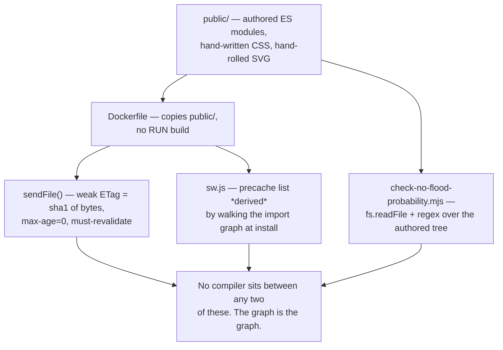

# ADR-001: Zero front-end dependencies and no build step

**Status:** Accepted
**Applies to:** `public/`, `Dockerfile`, `deploy/one-click.sh`, `scripts/check-no-flood-probability.mjs`
**Deciders:** anyone adding a library, a framework or a build step

## Context

`package.json` declares exactly one runtime dependency, `pg`, and **no `devDependencies` block at
all** — not an empty one. There is no bundler, no transpiler, no framework, no CSS preprocessor and
no test-runner dependency; the test runner is `node --test`.

What ships is therefore exactly what is authored. `Dockerfile` copies `public` into the image and
runs `npm start`. There is no `RUN build` step anywhere in it, so there is no build to fail in a
district office. `deploy/one-click.sh` is a bash script that checks for `docker compose`, generates
`.env` secrets, and runs `docker compose up -d --build`; the person running it never needs a Node
toolchain, a registry login or a bundler.

The front end is eight separate applications ([ADR-012](ADR-012-eight-separate-surfaces.md)),
authored as ES modules against a shared shell:

```
public/index.html          → <script type="module" src="/app.js">, <link href="/styles.css">
public/co/index.html       → <link href="/styles.css">, <link href="/components.css">, + its own app.js
public/app.js              → import … from '/shared/{basemap,flood-bands,map-frame,seasonal,
                                          app-version,runtime,fmt,labels}.js'
```

`styles.css` and `components.css` both `@import url('/tokens.css')`. Nothing is compiled, so nothing
can be stale relative to its source.

The pressure against this shape is real. A hand-authored console of this size is normally built with
a framework, and the obvious question is why it is not.

## Decision

**Zero front-end dependencies, and no build step at all.** The browser receives the authored bytes.
Three consequences are load-bearing and are stated here rather than left to be rediscovered:



1. **Cache busting is revalidation, not filenames.** `sendFile` computes `W/"<sha1 of the bytes>"`
   and sends `cache-control: public, max-age=0, must-revalidate` for JS and CSS. The reason is
   written in the source: *"Asset filenames are not content-hashed, so a long max-age would pin an
   operator to a stale build after a fix ships. Revalidate instead: cheap with an ETag, and
   correct."* A bundler would produce content-hashed filenames and let this be a long `max-age`;
   the trade is a per-load conditional request instead. That is the right trade for a 45 KB payload
   on a link that already fell over once today.
2. **The precache list is derived, not maintained.** There is no bundler to emit a manifest, so
   `sw.js` builds one itself: `shellGraph()` does a breadth-first closure from eight `index.html`
   entries plus four bootstrap assets, parsing `<link href>`, `<script src>`, `@import` and
   `from '…'` out of every fetched byte. The `CACHE_NAME` is bumped per release, and the worker
   calls `skipWaiting()` — *"on a long-lived ops console that is effectively never, so a deployed fix
   never reached the operator it was deployed for."*
3. **The claim guard reads the shipped surface.** `check-no-flood-probability.mjs` opens
   `src`, `public`, `scripts`, `test`, `docs` plus `README.md`, `CHANGELOG.md` and
   `connectors.registry.json` as plain text and matches regular expressions against them. That is
   only possible because the authored text is the shipped text.

## Options considered

### React, Vue or Svelte for the eight surfaces

| Dimension | Assessment |
|---|---|
| Component model | Removes the per-surface hand-written render functions that dominate `app.js` |
| Runtime cost | A framework runtime plus a JSX/Vue compiler — the thing being removed |
| Dependency cost | The build's whole purpose is to make dependencies ergonomic |
| The guard | Must still run over authored files, so it survives — but only because it predates the framework |
| Offline precache | Workable, but the graph becomes framework-internal rather than visible in `public/` |
| Fits this product? | No |

**Rejected.** The decisive cost is the guard, and then the deployment. `check-no-flood-probability.mjs`
exists because *"a flood probability asserted in the OpenAPI contract, in a dashboard label, or in the
README is the thing a panel would act on."* A framework makes the panel's code a function call tree
rather than text. The guard would still scan source, so nothing is lost — but the shipped artefact
would no longer be the auditable object, and the property that makes this codebase cheap to audit
would quietly become true only of a directory nobody serves.

Second cost: this product must run where the operator is. Adding a framework to satisfy the eight
surfaces does not remove `docker compose` from the install path; it adds a compile step in front of
it.

### A bundler — esbuild, Rollup, or Vite

| Dimension | Assessment |
|---|---|
| Tree-shaking and minification | Real: `app.js` is 154 KB raw, ~45 KB gzipped |
| Cache busting | Better than ETags — content-hashed filenames allow `immutable, max-age=1y` |
| Precache list | Solved: the bundler emits the manifest |
| The guard | Still scans authored source; but the artefact stops being the auditable text |
| `deploy/one-click.sh` | Grows a build step and a second failure mode in front of `docker compose up` |
| Failure shape | A build failure is now a deploy failure, in front of an operator who cannot read a stack trace |

**Rejected.** Every gain is bandwidth and cache lifetime on a 45 KB payload. The costs are a
compilation step inside a deployment script written for people who are not Node experts, and the loss
of the invariant that the bytes on the wire are the bytes in the repository.

The precache point deserves a note, because it cuts the other way: a bundler *would* have prevented
the worst bug this decision produced.

### A component library — MUI, shadcn/ui, or similar

| Dimension | Assessment |
|---|---|
| Accessibility | Much of it is already done — which is the point of using it |
| Bundle cost | High, and it is exactly the bundle that ADR-001 refuses |
| Theming | The design tokens already exist in `tokens.css` |
| What is actually re-used | Ten modules in `public/shared/`, ~2,470 lines, hand-written |

**Rejected.** `components.css` and `tokens.css` already do the part that matters — one set of
primitives referenced by every surface. A component library would replace a 24 KB stylesheet with a
framework-coupled one and add a build step to [Options above](#a-bundler--esbuild-rollup-or-vite).

### A charting library — and `d3` specifically

| Dimension | Assessment |
|---|---|
| The map | Hand-rolled: `SVG_W = 800`, `SVG_H = 500`, `project()` maps degrees to viewBox units ([ADR-008](ADR-008-hand-rolled-svg-map.md)) |
| The CO sparklines | Hand-rolled in `buildSparkline` (`co/app.js`) |
| The dispatch-lag histogram | Five `<div>`s with an inline `height` in px |
| Bundle cost | `d3` alone is ~250 KB minified before a single pixel is drawn |
| What the hand-rolled version got right | `buildSparkline` distinguishes "no value" from "zero" |

**Rejected**, and this is the decision whose value is easiest to demonstrate. The library versions of
these three were tried in the sense that a first pass drew them, and both were wrong in ways the
source records:

- The sparkline *"used to be filled with 0 before plotting, so a month with no recorded outcome drew
  as a flat line sitting on the axis — visually identical to a month in which nothing happened. That
  is the same absence-as-zero mistake the KPI itself was making, one layer down."*
- The histogram *"was a labelled empty div: aria-label on a div with no role announces the label and
  nothing else, so the chart was five coloured rectangles with no values."* It is now `role="img"`
  with the distribution in a `<table>` beside it.
- The map's framing bug — *"framing on all of them squeezed five pilot districts into an unreadable
  smudge"* — was a bbox policy bug found by screenshotting the running dashboard, not by a library.

Every one of these was fixed by knowing exactly what the DOM contained. A charting library would
have put the fix one layer below the thing being fixed.

### No `devDependencies` at all

**Considered, kept.** Tests run on `node --test`, coverage on `--experimental-test-coverage`. There is
no ESLint, no Prettier and no bundler dev-dependency, which means `npm ci` is a single fast step and
the CI environment has no install-time failure surface beyond `pg`.

## Consequences

**Easier**

- **The deploy has nothing to fail.** `npm ci --omit=dev && npm start`. A district office with a
  slow link and no spare disk is the design target.
- **The build-time claim guard sees the claim.** `fs.readFile` plus a regex over `public/` catches a
  forbidden capability wherever a human would read it, which is what [ADR-010](ADR-010-build-time-claim-guard.md)
  depends on.
- **A served file is a readable file.** Anything an operator or an auditor needs to look at can be
  opened in a text editor, fetched with `curl`, or read in devtools, with no sourcemap step in
  between.
- **Serving is one function.** `sendFile` replaced *"fifteen near-identical readFile/writeHead/end
  blocks that each decided caching independently — and none of which sent a Cache-Control."*
- **Charts are exactly as accessible as their DOM.** `role="img"` and an alternative `<table>` are
  not configuration.

**Harder**

- **154 KB of `app.js`, ~45 KB gzipped.** The server compresses it — every text response is gzipped
  when the client accepts it — but nothing is tree-shaken, so a browser downloads the whole module
  whether or not the operator touched the feature it contains.
- **A missing module is a hard boot failure, not a degradation.** This is the sharpest cost, and it
  is a real one that has already been paid. `sw.js` records it:
  > *"It used to be a hand-written list, and a hand-written list of an import graph is wrong the
  > moment anyone adds an import. It omitted all seven /shared/*.js modules app.js needs, then
  > /shared/fmt.js, /shared/labels.js and /components.css after someone repaired it by hand — each
  > repair a snapshot, each snapshot a chance to forget. A missing ES module is a hard
  > module-resolution error rather than a degraded load, so the console failed to boot offline
  > entirely: the one case the offline work exists for."*
  `app.js` now imports nine distinct `shared/` modules. There is still no bundler to emit a
  manifest; the fix is that `shellGraph()` derives the list at install time and
  `test/web-chw-offline.test.js` checks it against the files on disk — *"the list that used to live
  here was never checked against anything."* The invariant moved from convention to test. It should
  not be read as a claim that the constraint went away: the hard failure mode is inherent to ES
  modules and will be paid again by anyone who adds an import the graph walker cannot see.
- **Every surface carries its own copy of patterns until something extracts them.** The seven
  sub-surface `app.js` files total ~2,500 lines beside the shared shell. The CSS layer shows it
  too: `districts/index.html` still *"restates the shared card treatment (.rule-card in
  components.css) … Same border, radius and background as every other card in the product: a
  district card that looks different reads as a different product."* Extraction is manual,
  surface-by-surface, and the comments in `co/` and `scenarios/` show the debt being paid down rather
  than prevented.
- **Every viewBox unit is a design decision made by hand.** Marker hit radii are computed in viewBox
  units from a measured CSS width (`viewBoxUnitsPerPx`, `hitRadiusUnits`) because *"viewBox units
  alone is therefore 24px on a desktop and 8px in the field"* — a problem a mapping library's
  interaction layer would not have had.
- **No tree-shaking, ever, unless that changes.** Adding a helper to `shared/` ships it to all eight
  surfaces.

**Revisit when**

- `app.js` grows past the point where a single unminified module is a review problem rather than a
  size one. The trigger is diff readability, not bytes, because gzip already handles bytes.
- A second operator of this codebase wants to add a UI dependency. That is the moment to argue the
  case properly rather than by default — but the answer is more likely to be a hand-written module
  in `public/shared/` than a package.
- The precache graph becomes un-derivable — a surface that loads modules by computed URL rather than
  by a literal `from '…'`. `parseReferences` cannot see that, and it is the one shape that would make
  the derived manifest wrong in exactly the way the hand-written one was.

Related: [ADR-008](ADR-008-hand-rolled-svg-map.md), [ADR-010](ADR-010-build-time-claim-guard.md), [ADR-012](ADR-012-eight-separate-surfaces.md)
