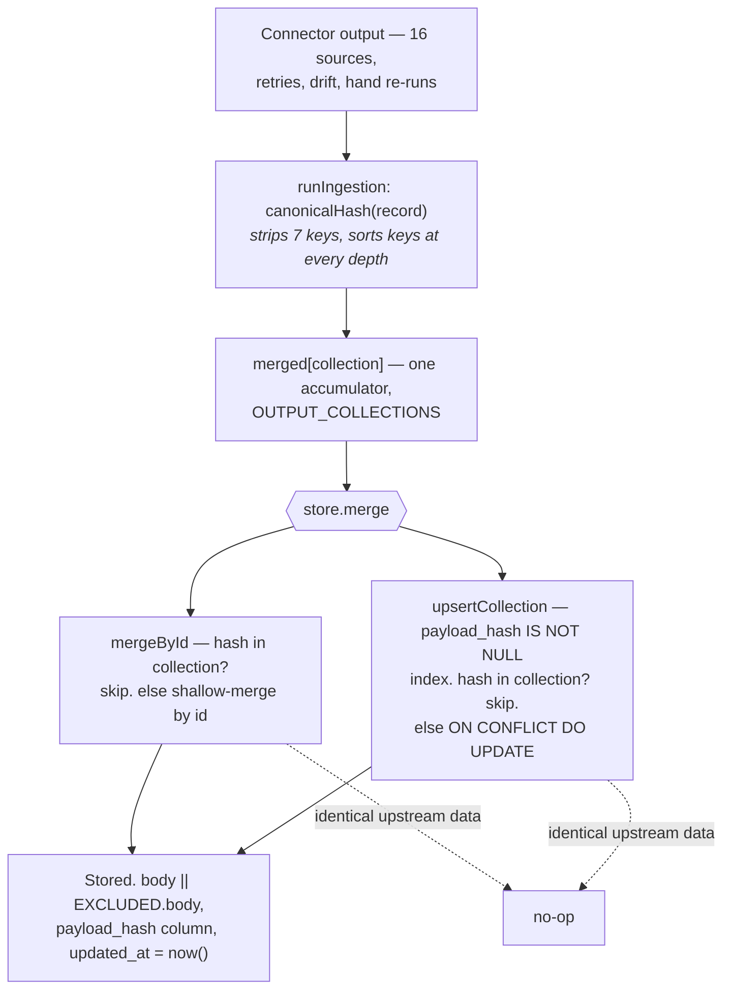

# ADR-003: Content-hash idempotency for ingestion

**Status:** Accepted — the canonicalisation defect recorded in `docs/demo-audit-2026-10-02.md` (row 13) was the previous version of this decision
**Applies to:** `src/utils.js` (`canonicalHash`, `canonicalise`, `stableId`), `src/ingestion.js`, `src/store.js` (`mergeById`), `src/postgres-store.js` (`upsertCollection`, `insertRecords`)
**Deciders:** anyone who adds a field to a connector's output, or changes the ignore list

## Context

Sixteen connectors, several third-party, some rate-limited, some with payloads that change shape
between calls. Ingestion runs from an HTTP endpoint that the scheduler sidecar POSTs on a timer, that
an operator can trigger by hand, and that retries internally. **Every connector will eventually
double-fire** — a network retry, a scheduler drift, a re-run by someone who did not know it had
already run.

The failure mode that matters here is not a crash. It is a doubled record surviving into analytics,
where it inflates a count that a district officer acts on. `mergeById` handles the JSON backend and
`upsertCollection` the Postgres one; both skip an incoming record whose `payload_hash` is already
present in that collection, so a second identical run is a no-op at the storage layer rather than a
decision anyone has to make correctly by hand.

Identity is deterministic too. `stableId(prefix, value)` is `sha256(JSON.stringify(value))` truncated
to 16 hex characters, so the same upstream record gets the same id on every machine. This is the
house idiom rather than a one-off: `outbox.emit` derives its id from `[event, JSON.stringify(payload)]`
for exactly the same reason.

### What this replaced

`docs/demo-audit-2026-10-02.md` records the bug at row 13:

> `canonicalHash` was blind to metadata, so no connector metadata correction could ever reach stored
> data.

The mechanism was in `canonicalise`. It used `JSON.stringify(filtered, Object.keys(filtered))`, and
the second argument to `JSON.stringify` is a property *allowlist* that applies at every level of
nesting — so only top-level keys survived. `metadata` remained as a key and every key inside it was
dropped. The source states the consequence without softening it:

> `metadata` was kept as a key but every key inside it was dropped, and the hash of a record was
> identical no matter what its metadata said. … Since connector metadata is where the qualifications
> and provenance live, the one thing that must be able to change is exactly what could not.

A **corrected** upstream value could never overwrite the stored one, because the correction landed in
a field the hash could not see.

### The ignore list is load-bearing

`canonicalHash` strips seven keys before hashing:

```
id, payload_hash, ingested_at, generated_at, updated_at, created_at, first_seen_at
```

Everything else — every content field, including everything nested — is hashed, with object keys
sorted at every depth so that two structurally identical records hash identically regardless of key
order.

This list is a decision, not a convenience. A field added to it stops being able to cause a
re-ingest, and that is correct for all seven of them and wrong for anything else. The seven are the
record's identity and the system's own bookkeeping: none of them is upstream content, and `updated_at`
in particular is written by the application on every write, so including it would make every record
change on every touch and defeat dedup entirely.

## Decision

Stamp a content hash at ingest; treat "same content" as "nothing to do".



The two backends implement the same rule independently, and `test/store-conformance.test.js` runs the
same assertions against both:

- **Skip before write.** A record carrying a `payload_hash` already in the collection is dropped. The
  skip is unconditional on whether the ids match, because a changed upstream id with identical
  content is still identical content.
- **Otherwise shallow-merge by id.** `map.set(item.id, { ...map.get(item.id), ...item })` in JSON;
  `body = lite_records.body || EXCLUDED.body` in Postgres. A PATCH-style update that sends three
  fields does not erase the other forty.
- **`payload_hash` is a column, not a body field.** `ensureSchema` adds it and backfills it from
  `body->>'payload_hash'`, and it is partly indexed on `(collection, payload_hash) WHERE payload_hash
  IS NOT NULL`. `insertRecords` exists solely because omitting it *"meant a single write() call
  silently disabled content-addressed dedup for the life of the table (DAT-01)."*
- **Records without a hash always write.** The skip is guarded by `if (item.payload_hash && …)` in
  both backends, so the operational API's creates and updates — which carry no `payload_hash` — are
  unaffected. This is why soft delete works: `buildSoftDelete` stamps `deleted_at` and merges, and the
  record is written because it was never hashed in the first place.
- **`first_seen_at` is stamped once and never refreshed.** `runIngestion` sets it only
  `if (!record.first_seen_at)`, and it is in the ignore list, so an unchanged record that skips
  entirely cannot advance it. The field therefore answers *"when did we first see this"*, not *"when
  did we last write this row"* — a distinction that has to be deliberate, because the two are the
  same field name everywhere else.
- **`stableId` gives the hash something to be about.** Ids are deterministic, so a re-ingest targets
  the same primary key; without that, dedup would have to be purely by content and the store would
  accumulate near-duplicates with distinct ids.

## Options considered

### Natural keys — treat each connector's own identifier as the version

| Dimension | Assessment |
|---|---|
| Readable | Yes — "the same hazard event" is obvious |
| Availability | Decided per connector, by a third party |
| Stability | Unreliable — sources restate, re-key and de-duplicate their own history |
| Cross-source | Two sources describing one event have different keys |

**Rejected.** Sixteen connectors disagree about what identifies a record, and the disagreement is not
resolvable from inside this product. GDACS reports the same flood under a different identifier across
archive and live feeds; IPC and CHIRPS disagree about whether an administrative boundary or a
spatial cell is the unit. Worse, a natural key says nothing about *whether the content changed* —
it collapses the question this ADR exists to answer into one about naming.

### Timestamps as versions — re-fetch that returns a newer `observed_at` is an update

| Dimension | Assessment |
|---|---|
| Trivial to implement | Yes |
| Correct | No |
| Failure mode | A re-fetch of identical data looks new and rewrites every record on every run |
| Withdrawn upstream record | Nothing removes a row, so a retraction is invisible either way |

**Rejected.** Most re-fetches return *identical* data. Versioning on arrival time makes every
scheduled run a full-collection rewrite, which is precisely the doubling the ADR exists to prevent —
and it does so invisibly, because a rewrite that lands the same values looks like a successful no-op
in every log and every dashboard.

### Delete-and-reinsert per collection on each run

| Dimension | Assessment |
|---|---|
| Guarantees freshness | Yes, completely |
| Idempotent | Only if the replacement is byte-identical |
| Soft-deleted records | Destroyed — the delete is not conditional |
| Action-log history | Destroyed |
| Read cost | The whole collection is rewritten on every run |

**Rejected.** `buildSoftDelete` exists precisely so that *"records are never removed from the store
so action-log history and any downstream references (tasks → interventions, field_reports →
incidents) stay resolvable"* ([ADR-007](ADR-007-soft-delete.md)). A blanket delete-and-reinsert
would un-delete every soft-deleted record on the next scheduled run of the connector that produced
them — which for operational records is an operator's deliberate action, undone by a timer.

### An external queue, or change-data-capture on the source

| Dimension | Assessment |
|---|---|
| Exactly-once semantics | The queue's, not ours — and CDC on a third-party REST API is not a thing |
| Operational cost | A broker, a worker, a dead-letter queue, a retention policy |
| Fits `docker-compose.yml`? | No |
| Solves the actual problem | Only if the double-fire is the issue. It is: it is a dedup rule, not a delivery problem |

**Rejected.** This is a dedup rule wearing a distributed-systems costume. The schedule is a
`sh -c curl` loop in a sidecar ([ADR-009](ADR-009-external-scheduler.md)); the deployment target is a
district office server. A broker would be the largest component in the product and would exist to
solve a problem two `Map` lookups already solve correctly in both backends.

## Consequences

**Easier**

- **Double-firing is a non-event.** A retried connector, a drifted schedule and a hand-triggered
  re-run all converge on the same stored state without anyone deciding they should not.
- **The store is the deduplicator, not the caller.** No connector needs to know whether it has run
  before, and no caller needs to pass a flag that says so.
- **A correction lands automatically.** When upstream fixes a value, the content changes, the hash
  changes, the record is not skipped, and the shallow merge overwrites the field. This is the case
  that was broken by the nested-metadata bug and it now works by construction.
- **`payload_hash` is queryable.** It is a column, partly indexed, and it is what makes the dedup a
  set lookup rather than a table scan.
- **Lineage can name what was ingested.** `recordLineage` computes `upstream_checksum` as
  `canonicalHash({ hashes: payloadHashes })` over the run's records — the same primitive, applied to
  the batch.

**Harder**

- **A genuine change confined to the ignore list will not land.** This is exactly the bug class the
  first version had, inverted: today the seven ignored fields cannot cause a re-ingest, and if one of
  them ever becomes the place a correction is expressed, the correction is silently dropped. The
  ignore list is therefore a schema decision, and it is written as a default parameter so a caller
  can override it — nothing currently does.
- **`updated_at` must stay in the list.** It is the tempting one to remove, because a stale
  `updated_at` looks like a defect. Removing it makes every application write look like new content
  and re-ingests the world. Anyone "fixing" the ignore list needs that sentence.
- **A corrected record whose content did not change is indistinguishable from a no-op.** The stored
  `updated_at` does not move. This is arguably correct — nothing changed — but an operator watching
  for evidence that a fix propagated will see nothing, and there is no counter of skipped records to
  tell them the run happened.
- **A retracted upstream record never leaves.** Dedup is one-directional. A row stays until
  `apply-retention` expires it, which is the only path out of the store other than an explicit
  delete.
- **The same rule is implemented twice.** `mergeById` and `upsertCollection` are separate
  implementations of one semantic, in two files, in different languages' worth of query. They have
  already drifted once: `insertRecords` replaced `body` wholesale where `upsertCollection` merges it
  (`body = EXCLUDED.body` against `body = lite_records.body || EXCLUDED.body`), and the drift cost
  dedup for the life of the table (DAT-01). `test/store-conformance.test.js` is the mitigation, and
  it is a test rather than a shared implementation.
- **The hash keys on a list of field names that lives far from the data it describes.** Nothing in a
  connector's code says "this field is ignored by the store". A new provenance field is hashed by
  default, which is the safe direction, but the reader has to know the default exists.

**Revisit when**

- A connector needs a natural key that is genuinely more stable than its content — for example a
  source that mints a new id per page on every fetch. The answer is a connector-side `stableId`, not
  a store-side change.
- The number of collections a single run touches grows enough that `upsertCollection`'s
  `SELECT payload_hash FROM lite_records WHERE collection = $1` per collection per run becomes a
  measured cost. The index exists; the query is not batched.
- An upstream source starts retracting records rather than only correcting them. Then idempotency
  needs a tombstone path, which no store method currently offers.
- Ingestion ever runs on more than one process against one store. Today the guarantee is per-store
  and in-process, the same bound `createIdempotencyStore` states explicitly for request idempotency
  (*"the guarantee is bounded, and the bound is reported in the header rather than implied"*).

## The sibling failure mode

The most repeated structural bug in this codebase is a key list that two places maintain
independently. `COLLECTIONS` in `src/store.js`, `OUTPUT_COLLECTIONS` in `src/ingestion.js`, and the
hash ignore list in `src/utils.js` are three instances of the same shape: a set of names that decides
what happens to data, written down in more than one place, with no error when a name is missing from
one of them.

- `COLLECTIONS`: *"an unlisted collection's records are dropped silently — the same class of bug the
  runIngestion merged map had."*
- `OUTPUT_COLLECTIONS`: the counters *"used to be three separate lists and the counters named four of
  the six — so `ipc_hdx` … reported 'degraded — expected at least 1 records; received 0' on a fully
  successful run."*
- `canonicalHash`'s ignore list: nested metadata fell out of the hash, and corrections stopped landing.

The first two are now one exported list with registration tests asserting on real ingest runs rather
than on the spelling of a collection name, because *"a guard that greps source text for the spelling
of a collection name passes with this bug fully present."* The third is a default parameter with no
second list to drift from, but the same discipline is what stops a fourth.

Related: [ADR-002](ADR-002-single-table-jsonb-store.md), [ADR-007](ADR-007-soft-delete.md), [ADR-009](ADR-009-external-scheduler.md)
