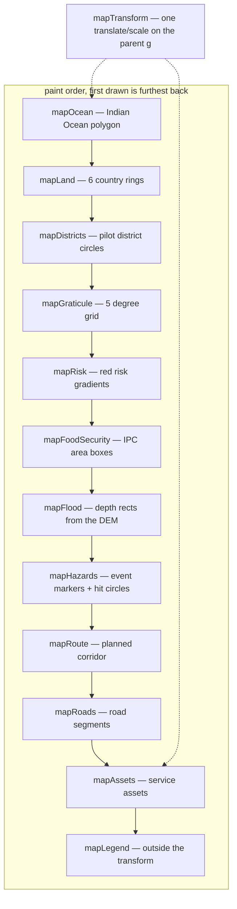
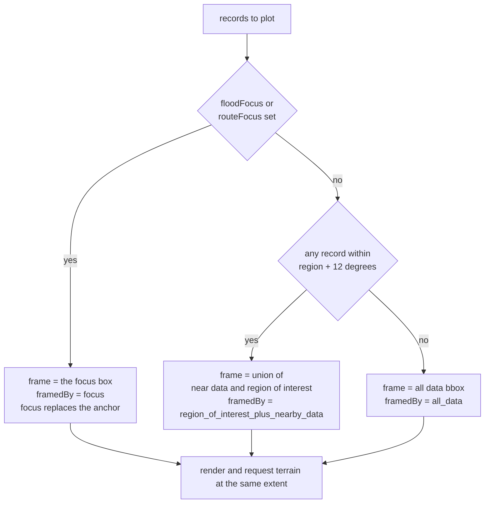

# ADR-008: Hand-rolled SVG rather than a mapping library

**Status:** Accepted
**Applies to:** `public/app.js` (map render and interaction), `public/shared/map-frame.js`,
`public/shared/basemap.js`, `public/districts/app.js`
**Deciders:** whoever wants to add a basemap, a layer, or a third-party script tag

## Context

The dashboard has one map. It draws a Horn of Africa basemap and eleven data layers on top: risk
gradients, IPC food-security areas, a flood-depth grid, hazard and asset markers, a planned route
and road access. There is also a second, smaller map on the district pages.

It is ~400 lines of SVG and it has no dependencies, no build step and no configuration. The
implementation is small enough to read in full:

```js
const SVG_W = 800
const SVG_H = 500

function svgEl(tag, attrs = {}) {
  const el = document.createElementNS('http://www.w3.org/2000/svg', tag)
  for (const [k, v] of Object.entries(attrs)) el.setAttribute(k, String(v))
  return el
}

function project(lat, lon, bbox) {
  const x = ((lon - bbox.minLon) / (bbox.maxLon - bbox.minLon)) * SVG_W
  const y = ((bbox.maxLat - lat) / (bbox.maxLat - bbox.minLat)) * SVG_H
  return { x: Math.round(x * 10) / 10, y: Math.round(y * 10) / 10 }
}
```

That is a linear equirectangular projection over a bounding box — correct at this scale, wrong
everywhere else, and it does not pretend otherwise. Pan and zoom are one attribute:

```js
mapTransformEl.setAttribute('transform',
  `translate(${state.mapTransform.x},${state.mapTransform.y}) scale(${state.mapTransform.scale})`)
```

on the `<g id="mapTransform">` that wraps every layer. Wheel multiplies the scale by 0.86 or 1.16
clamped to 0.3–10; pointer events use `mapEl.setPointerCapture(e.pointerId)` so a drag that leaves
the element keeps tracking; `dblclick` and the `0` key reset. Arrow keys pan, `+`/`-` zoom, and `t`
switches to the record list — the last added because, as the markup comment says, the map *"was
`role="img"` with no tabindex and pointer-only pan, zoom and marker drill-down: a keyboard or
screen-reader user could not open a single hazard, asset or IPC area."*

The basemap is six country rings as inline coordinate arrays in `public/shared/basemap.js` —
Kenya, Uganda, South Sudan, Ethiopia, Somalia, Tanzania — plus the Indian Ocean polygon, Lake
Victoria, and circles for the five pilot districts. The file's own header sets the standard:

> *"Horn of Africa basemap — inline polygon data, no network requests. … Accuracy: ~15-30 vertices
> per country, recognizable at glance, not survey-grade."*

`public/districts/app.js` builds a *second* SVG map with its own projection — a 320×200
data-fitted box with 24 units of padding, returned as a string for insertion. It is ~15 lines of
projection and it carries its own copy of the lesson that the equator is a coordinate:

> *"0 is a coordinate. The equator and the prime meridian both run through this project's districts,
> and `p.lat && p.lon` dropped every record sitting on either from the officer's map without a
> word."*

### Two constraints that decide this

**The product reaches exactly one thing off its own origin.** There is no `https://` URL in
`public/app.js` or any `public/shared/*.js` module except the SVG namespace string. The one outbound
dependency is terrain: `src/terrain.js` fetches `terrarium` tiles from
`registry.opendata.aws` server-side, with no key, lazily and cached in-process, and the front end
only ever asks *our* API for the resulting depth grid. A deployment is `one-click.sh` into a district
office, and the thing most likely to be broken in that building is not the laptop's DNS.

**This is not a navigation map.** It is a situational overlay on a country basemap. The requirement
is "draw these ~450 points, these polygons and these blobs over Horn of Africa, and let a person pan
and zoom". A library built for tiles of the world is solving a larger problem than the product has.

## Decision

Keep the hand-rolled SVG. `shared/map-frame.js` owns the framing and the event queries;
`shared/basemap.js` owns the geometry; `app.js` owns the element construction and the interaction.

### Layer stack, in paint order

Paint order is z-order, and it is not arbitrary — it is the comment in `public/index.html`, written
when the flood layer was moved above the risk blobs:

> *"The flood depth layer sits above the risk blobs, not below: an operator who asked for an
> inundation simulation is looking for water, and the red risk gradients are opaque enough to bury
> it entirely. IPC area boxes shade below the flood layer so a flood simulation stays legible inside
> them; road markers stay on top of all so a cut-off segment is never hidden by the shading it
> caused."*



Two properties fall out of this shape. Every layer is inside one transform, so pan and zoom are one
attribute write and the browser handles the rest — the flood grid's comment says it draws *"as SVG
rects in map space, so it stays crisp under the existing pan/zoom transform instead of being
rasterised once."* And the legend sits *outside* `#mapTransform`, so it does not scale with the map.

### Frame selection

Framing is the part that was actually wrong, twice, and both bugs are quoted in
`public/shared/map-frame.js`, which was extracted to be testable without a DOM.

The first: GDACS is a worldwide feed, and framing on whatever it contained squeezed the pilot
districts into nothing.

> *"GDACS is a worldwide feed. A seeded demo pulls ~125 geolocated events spanning 131 degrees of
> longitude, and under 1% fall inside the region. Framing on all of them squeezed five pilot
> districts into an unreadable smudge, so near-region points shape the extent and distant ones are
> drawn but do not dictate it."*

The second, and worse, was not in the projection at all — it was in the query.

> *"The map used to fetch `/api/v1/events?limit=50` and nothing else. That is the 50 most recent
> events worldwide, and with GDACS and USGS both live it is always the same handful of Pacific and
> Caribbean earthquakes. The two hazards the entire road-access and routing walkthrough depends on
> — a flood cutting the Lodwar corridor and a landslide across the Turkana supply route — were
> paginated out and never reached the map. Nothing failed: the API answered, the map drew 33
> circles, and the operational area looked free of hazards."*

The fix is two separate requests — everything inside the region (`LOCAL_CONTEXT_LIMIT = 400`) plus a
bounded slice of recent global events for context (`GLOBAL_CONTEXT_LIMIT = 50`) — merged by id with
the local copy winning, so **neither set can starve the other**. Up to 450 records reach the map.



The focus rule is the third decision in the same file, and it is a precedence decision:

> *"A focus REPLACES the region-of-interest anchor rather than unioning with it. Unioning is what
> makes framing work when the anchor is derived from data, but an explicit focus is the operator
> saying 'zoom here' — unioning it with a 25-degree region would leave the focus a no-op and the
> shaded district still a few pixels wide."*

So the precedence is: an active flood simulation or a planned route replaces the frame; otherwise the
frame is the region of interest unioned with nearby data; otherwise, if nothing is near, all the
data. `framedBy` is returned so a reader can tell which rule fired. The draw extent and the terrain
request extent are deliberately the same object, because a terrain request for the globe *"would
time out or silently drop to a zoom where cell depths average across whole landscapes."*

## Options considered

### Leaflet

| Dimension | Assessment |
|---|---|
| Fit for the task | Better than nothing — it is a lighter library than MapLibre |
| Basemap | Mandatory in practice. It will render your tiles if you give it a tile layer; there is no useful default |
| Supply | Tile server URL and attribution required. A free keyless provider is an external dependency with an uptime SLA you do not control |
| Front-end dependencies | Breaks ADR-001. Would have to be vendored as a script tag; ~40 KB minified and a second thing to keep current |
| What it would buy | Tile caching, rotation, marker clustering, a real projection library, attribution handling |
| What it would cost | An operational surface in a district office, for features the product does not use |

**Rejected.** Leaflet is the right answer for a map that needs a basemap. This map has a basemap —
six polygons — and needs nothing else Leaflet provides. The dependency is not refused on principle;
it is refused because there is no tile source to point it at that does not add a network dependency
the product does not have today.

### MapLibre GL

| Dimension | Assessment |
|---|---|
| Rendering | WebGL. Excellent for thousands of features |
| Weight | The largest of the three, and it wants a vector tile source or a GeoJSON source it manages itself |
| Front-end dependencies | Breaks ADR-001 hardest of the three; a GL context in a browser on a district-office laptop is its own support burden |
| Server | MapLibre is a *server* too — tiles, styles, glyphs. Adopting it means running one |
| Offline | Its offline story (`maplibregl` cached styles) still assumes a style server at deploy time |

**Rejected.** It optimises for a scale the map is nowhere near and introduces the largest new
operational surface of the three. The 450 markers are not a GPU problem.

### D3

| Dimension | Assessment |
|---|---|
| Fit for the task | Genuinely good. Scales, projections, axes and zoom behaviour are exactly what it is for |
| Front-end dependencies | Breaks ADR-001. ~90 KB min, vendored as a script, still a second thing to keep current |
| What it would buy | `d3.geoPath` with real projections, `d3.zoom` with proper pointer and touch semantics, scale-driven styling |
| What it would cost | The parts already written and working — the projection, the transform, the wheel and pointer handling, the keyboard path, the accessibility work |
| Honest verdict | **The strongest of the rejected options, and a straw man would call it a straw man.** At 800×500 with 450 points, D3 is not needed for performance |

**Rejected** on the dependency rule, not on capability. If the product ever needs a projection with
real datum handling, per-zoom styling, or a genuinely large point count, D3 is the first thing to
revisit — and the ~400 lines it would replace are small enough that replacing them is a day, not a
quarter. The decision is reversible; it is recorded so nobody rediscovers it.

### Pre-rendered server-side image

| Dimension | Assessment |
|---|---|
| Front-end dependencies | None |
| Basemap | Solved — render it wherever |
| Interactivity | Lost. Pan, zoom, marker drill-down, hover, the keyboard path, the hit targets: all gone |
| Freshness | An image per refresh per frame, for a map whose whole value is showing where things are now |
| Alt text | One string for an image. The current `aria-label` names what is plotted *and* how many records were dropped for having no coordinates, which an image cannot |

**Rejected.** The map is an application (`role="application"`, `tabindex="0"`, arrow keys, `+`/`-`,
`0`, `t`), not a picture. Rasterising it reverts the accessibility work that the markup comment
describes in detail.

## Consequences

**Easier**

- No build step, no bundle, no vendored script, no licence to track. `package.json` has one runtime
  dependency, `pg`, and none of them is JavaScript that runs in the browser.
- Nothing to phone home to. The map is in the HTML the server already sent.
- Every layer is plain SVG in the DOM, so the accessibility surface is direct: the record list below
  the map is the text alternative, and marker hit targets are sized in viewBox units by
  `hitRadiusUnits(viewBoxWidth, cssWidth)` so they stay ≥ 24 CSS px whatever the container width —
  measured per render, because the map is fluid.
- Adding a layer is one `<g>` in the markup and one render function. There is no layer lifecycle,
  no source, no style object.
- Projection, framing and basemap geometry are in three small modules that import cleanly into Node
  and are tested without a DOM — which is only true because they were extracted after two framing
  bugs.

**Harder**

- **No tile cache, and the basemap cannot get better.** The inline rings are ~15–30 vertices per
  country and the file says so: *"recognizable at glance, not survey-grade."* Zooming to 10× on
  Turkana gives the same coastline, larger. That is the single largest capability given up, and it
  is permanent without a new data source.
- **No rotation, no pitch, no projection control.** Zoom is 0.3–10 and pan is a translate. There is
  no compass, no north-up toggle, and no way to fix a projection the operator dislikes.
- **No clustering, and ~450 hit targets.** `mergeEventSets` can return 400 local plus 50 global
  events, each rendered as a marker with a transparent hit circle. Where the global context set
  overlaps a busy area, markers overlap — there is no declutter, no spider-fy, no density binning.
  It is legible because the frame is the pilot region; it would not be at continental scale.
- **No labels or roads basemap.** The only text on the map is the graticule's own degree labels and
  the five pilot district names (`renderBasemap` draws a `<text>` beside each district circle).
  There are no town names, no rivers, no roads, no coastline features. An operator can find Lodwar
  because Turkana is labelled and they know where it is, not because the map says so.
- **`preserveAspectRatio="xMidYMid meet"` letterboxes.** At any container aspect other than 16:10 the
  drawn content does not fill the box — it is centred with bands left and right or top and bottom,
  and the bands are dead space inside an element that still receives wheel and pointer events. This
  is the right default (nothing is cropped) but it means the *visual* map is smaller than the
  container at most window sizes, and the bands swallow the first drag a user makes towards an edge.
- **Pan deltas mix coordinate systems.** The pointer handlers read `e.clientX` in CSS pixels and
  write the delta into a `transform` measured in viewBox units, so a drag tracks the cursor exactly
  only when one CSS pixel equals one viewBox unit — an 800 px-wide container at scale 1. At any
  other width the map moves too little, and at any zoom above 1 it moves too much. Nobody has filed
  this because nobody has noticed, which is not the same as nobody being affected.
- **Two projections, not one.** `public/districts/app.js` has its own `project` with its own
  padding and its own 320×200 box, and it returns an SVG *string* while `app.js` returns *elements*.
  The consistency between them is a convention, not a shared module.
- **Precision is fixed at write time.** `project` rounds to 0.1 viewBox units to keep the DOM small.
  At 10× zoom a 0.1-unit rounding is a visible half-pixel wobble on a marker.

## Revisit when

- The basemap has to become survey-grade, or an operator asks for place labels. Both need a data
  source, and a data source is what pulls a library in with it.
- The record count goes up by an order of magnitude and markers genuinely overlap in the pilot
  region. Clustering is then worth a dependency.
- The product gains a second map that must agree with the first, in projection and in interaction.
  At that point the two projections become one shared module, whichever library is or is not in play.

Related: [ADR-001](ADR-001-zero-frontend-dependencies.md),
[ADR-002](ADR-002-single-table-jsonb-store.md)
