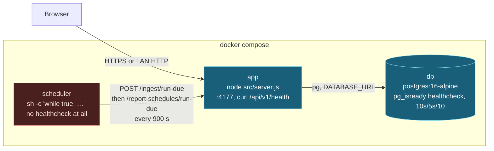
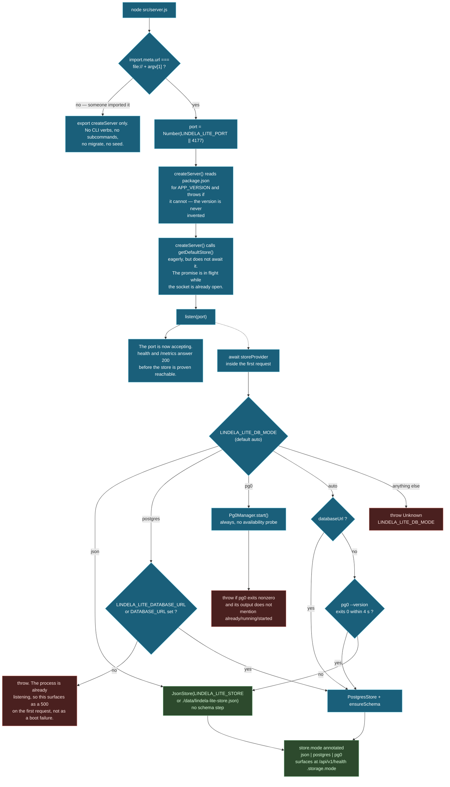
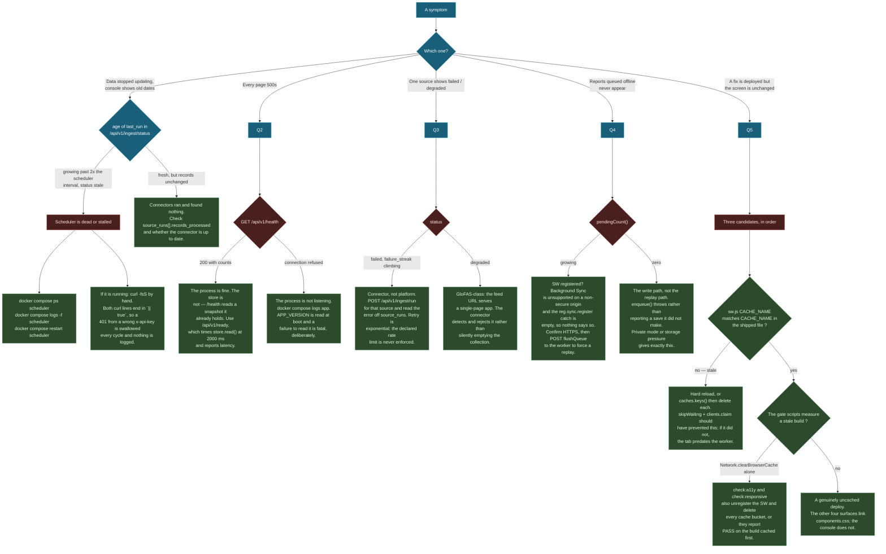

# Deployment

Topology, configuration, and — more than half of this document — what to do when it
is down. Lindela Lite is three containers and no orchestrator, so most of the
operational surface is knowing which of the three stopped and what its absence
looks like from the other two.

Read [system-overview.md](system-overview.md) §3 for the topology in one picture,
and §6–§7 for the boundary failures and the deliberate limitations.

---

## 1. The single most important operational fact

**If the `scheduler` container dies, ingestion stops, and nothing in the app
notices.**

There is no in-process timer anywhere in `src/` — no `setInterval` for ingestion,
no cron, no worker thread, no queue consumer. Recurrence is entirely a shell loop in
a sidecar container that `curl`s the API every
`LINDELA_LITE_SCHEDULER_INTERVAL_SECONDS` (default 900). The app has no heartbeat,
holds no lock, and does not check whether anyone is calling `run-due`. A dead
scheduler is indistinguishable, from inside the process, from a quiet night.

This is a deliberate trade, recorded in `system-overview.md` §3: a crash-looping
app cannot also silently accumulate timers, and a deployment that forgets a
scheduled job cannot also forget its lock. The cost is real and it is the reason
this document exists.

**How to detect it.** `GET /api/v1/ingest/status`, per source:

- **`age(last_run.completed_at)`** — the only reliable signal. If it exceeds the
  scheduler interval by more than one cycle, the scheduler is not calling.
- **`status: 'stale'`** — computed by `sourceHealth` against
  `schedule.stale_after_minutes ?? policy.stale_after_minutes`.
- **`failure_streak: 0` does not mean healthy.** `failureStreak` counts
  consecutive `source_runs` rows with `status === 'failed'`. **A scheduler that
  never calls produces no rows at all**, so the streak stays at whatever it was —
  usually zero. A rising streak means the connectors are failing. A zero streak
  with a growing `last_run` age means nothing is running. Reading the streak alone
  is how a dead scheduler looks like a healthy one.

**How to fix it.**

```bash
docker compose ps scheduler
docker compose logs -f scheduler
docker compose restart scheduler
curl -fsS -X POST http://127.0.0.1:4177/api/v1/ingest/run-due \
  -H "x-api-key: $LINDELA_LITE_API_KEY"   # force one cycle by hand
```

If it is running and still not calling: **both `curl` lines in the sidecar end in
`|| true`**, so a `401` from a wrong or unset `x-api-key` is swallowed every cycle
and nothing is logged anywhere. `docker compose logs scheduler` will be empty and
the container will be healthy. Curl the endpoint by hand and read the status code.

## 2. Topology



Note what `scheduler` has and does not have: **no `healthcheck` stanza**. Compose
cannot mark it unhealthy, so `depends_on: app: service_healthy` protects its *start*
and nothing after that. `restart: unless-stopped` restarts it if the *process*
exits, but the loop cannot exit — `curl … || true; curl … || true; sleep 900`
never fails out. A scheduler wedged on an unreachable network is running, healthy by
every signal compose has, and calling nothing.

## 3. Startup



**There is no subcommand parsing.** The bottom of `src/server.js` is four lines:

```js
if (import.meta.url === `file://${process.argv[1]}`) {
  const port = Number(process.env.LINDELA_LITE_PORT || 4177)
  createServer().listen(port, () => { /* … */ })
}
```

`node src/server.js --migrate` passes `--migrate` to nothing and starts normally.
Schema setup is `ensureSchema()` inside store construction; seeding is
`npm run demo:seed`; validation is `npm run validate`. A CLI that grew verbs would
be a different architecture.

**`createServer(options)`** takes an optional `store`, which is how
`test/*.test.js` runs the whole HTTP surface against a fixture store with no
database and no environment.

### Store selection

`createStoreFromEnv` in `src/storage.js`, in precedence order:

| `LINDELA_LITE_DB_MODE` | Behaviour |
|---|---|
| `json` | `JsonStore(LINDELA_LITE_STORE \|\| ./data/lindela-lite-store.json)`. No schema step. |
| `postgres` | Requires `LINDELA_LITE_DATABASE_URL` or `DATABASE_URL`; **throws** without one. |
| `pg0` | `Pg0Manager.start()` unconditionally — no availability probe. |
| `auto` *(default)* | `databaseUrl` → postgres. Else `pg0 --version` exits 0 within 4 s → pg0. Else JSON. |
| anything else | Throws `Unknown LINDELA_LITE_DB_MODE`. |

`auto` is the mode that matters in the field. In the compose `app` service it is
overridden to `postgres` explicitly, so the fallback chain never runs there. Run
from a laptop with no Postgres and no `pg0` binary, it lands on JSON, and **the
choice is invisible until you look at `/api/v1/health`**, which reports
`storage: { mode }`. `docker compose logs app` says only "listening on".

`postgres` and `pg0` both call `ensureSchema()` — one `CREATE TABLE IF NOT EXISTS`
and the vocabularies in `schema.js`. It is idempotent and runs on every boot.

### Ordering, and what it means for readiness

`getDefaultStore()` is called eagerly inside `createServer`, which *starts* the
async store construction. It is **not awaited** before `listen`. Consequences:

- The port is accepting before the store is proven reachable. `/metrics` and
  `/api/v1/health` — neither of which needs the store — answer `200` while the
  database is still down.
- A store construction failure (missing `DATABASE_URL`, pg0 refusing to start, an
  unreachable host) surfaces as a rejected promise awaited inside the request
  handler, i.e. a **500 on the first request that needs the store**, not a boot
  failure. The container stays up. Compose's healthcheck, which curls
  `/api/v1/health`, passes.
- `APP_VERSION` is read once at startup and a failure to read `package.json` **is**
  fatal. That asymmetry is deliberate: an unknown version must not be invented, but
  an unreachable database is a runtime condition the app can report on.

**This is why `/api/v1/ready` exists** and why `/api/v1/health` alone is not a
readiness signal. See §7.

## 4. Configuration

Every environment variable the runtime reads, grouped by who sets it.

### Set by the operator (deployment)

| Variable | Default | Notes |
|---|---|---|
| `LINDELA_LITE_PORT` | `4177` | Read by the CLI at the bottom of `server.js`, and by `Dockerfile`'s `HEALTHCHECK`. Compose maps `${LINDELA_LITE_PORT:-4177}:4177`. |
| `LINDELA_LITE_DB_MODE` | `auto` | `json` \| `postgres` \| `pg0` \| `auto`. Compose sets `postgres`. |
| `LINDELA_LITE_DATABASE_URL` | — | Falls back to `DATABASE_URL`. Required when mode is `postgres`. |
| `DATABASE_URL` | — | Fallback only. |
| `LINDELA_LITE_STORE` | `./data/lindela-lite-store.json` | JSON store file path. |
| `LINDELA_LITE_API_KEY` | — | **Sets auth to a single `*`-scoped token.** See §6. |
| `LINDELA_LITE_TOKENS` | — | JSON array of `{token, scopes, partner_org?}`. Malformed throws. |
| `LINDELA_LITE_PUBLIC_PATHS` | — | Comma-separated, widens the public list. |
| `LINDELA_LITE_LOG_LEVEL` | `info` | `debug` \| `info` \| `warn` \| `error`. |
| `LINDELA_LITE_MAX_BODY_BYTES` | — | Request body cap. |
| `LINDELA_LITE_SCHEDULER_INTERVAL_SECONDS` | `900` | **Read only by `docker-compose.yml`**, never by `src/`. In the sidecar's shell, not in the app. |
| `LINDELA_LITE_UPTIME_OVERRIDE` | — | Pins the reported uptime. For load-balancer warm-up. |
| `NODE_ENV` | — | Set to `production` in the `Dockerfile`. |

### Set by the platform (pg0 — development only)

`PG0_BIN`, `PG0_NAME` / `LINDELA_LITE_PG0_NAME`, `PG0_PORT` /
`LINDELA_LITE_PG0_PORT`, `PG0_DATA_DIR` / `LINDELA_LITE_PG0_DATA_DIR`.
`Pg0Manager.available()` shells `pg0 --version` with a 4 s timeout. **There is no
`pg0` binary in the image** — `Dockerfile` installs `ca-certificates` and `curl`
only — so a container left in `auto` with no `DATABASE_URL` silently falls back to
a JSON store on an ephemeral filesystem.

### Set by the operator (data sources)

| Variable | Notes |
|---|---|
| `NASA_FIRMS_MAP_KEY` | Defaults to `OPEN_KEY` in `.env.example`. |

Full per-connector configuration — the CHIRPS, GloFAS, GDACS, USGS, NOAA, IPC/HDX
and WHO GHO endpoints and their polling intervals — is in `src/connectors/*` and
`src/ingestion.js`, not in the environment. See [ingestion.md](ingestion.md).

### Set by the operator (RapidPro)

| Variable | Default | Notes |
|---|---|---|
| `RAPIDPRO_BASE_URL` | `https://rapidpro.io` | |
| `RAPIDPRO_API_TOKEN` | — | Outbound SMS. |
| `RAPIDPRO_ALERT_MODE` | `flow_start` | Or `broadcast`. |
| `RAPIDPRO_ALERT_FLOW_UUID` | — | |
| `RAPIDPRO_ALERT_URNS` / `_CONTACTS` / `_GROUPS` | — | Comma-separated. |
| `RAPIDPRO_BASE_LANGUAGE` | `eng` | |
| `RAPIDPRO_WEBHOOK_SECRET` | — | HMAC key for the inbound webhook. See §6. |
| `LINDELA_LITE_RAPIDPRO_INSECURE_ALLOW_UNSIGNED` | — | Must be `1` to accept unsigned inbound webhooks. |
| `LINDELA_LITE_DHIS` | — | DHIS2 bidirectional sync, which is a scaffold. |

### Set by the operator (governance)

| Variable | Notes |
|---|---|
| `LINDELA_LITE_PII_SALT` | Key for `pii.js`. |
| `LINDELA_LITE_PII_POLICY` | Redaction policy. |
| `OFAC_SDN_CACHE_TTL_MS` | Sanctions list cache lifetime. |

Note `redactPii` is implemented and tested but **never called from a request path** —
see [system-overview.md](system-overview.md) §7.

## 5. Container and compose

### `Dockerfile`

```
FROM node:20-bookworm-slim
```

`npm ci --omit=dev` — so the runtime dependency surface is exactly `pg` and
whatever its tree. `ca-certificates` and `curl` are installed explicitly; `curl` is
for the `HEALTHCHECK` and `openssl`/`random_bytes` is not present, which is why
`deploy/one-click.sh` falls back to `node -e` for secret generation.

```
HEALTHCHECK --interval=30s --timeout=5s --start-period=20s --retries=5 \
  CMD curl -fsS "http://127.0.0.1:${LINDELA_LITE_PORT}/api/v1/health" >/dev/null || exit 1
EXPOSE 4177
CMD ["npm", "start"]
```

**The container runs as root.** There is no `USER` directive and no `node` user.
Anyone who can write to the mounted filesystem, or exploit the Node process, is
root in that container. Adding `USER node` requires chowning `data/` first, because
the JSON store and pg0's data directory are both written at runtime. Recorded as a
risk in §8, not as a defect.

`src`, `public`, `docs`, `examples`, `scripts`, `README.md` and `LICENSE` are
copied in. `test/` is not, and `node_modules` contains dev dependencies only
because `npm ci --omit=dev` runs before the source copy.

### `docker-compose.yml`

Three services, all `restart: unless-stopped`.

- **`db`** — `postgres:16-alpine`, volume `lindela_lite_pgdata`. Healthcheck
  `pg_isready -U $POSTGRES_USER -d $POSTGRES_DB`, 10 s interval, 5 s timeout, 10
  retries. `POSTGRES_PASSWORD` has **no default** — compose substitutes empty and
  Postgres refuses to initialise, which is the intended outcome.
- **`app`** — `depends_on: db: condition: service_healthy`, so Postgres finishes
  initialising before the first connection attempt. Maps
  `${LINDELA_LITE_PORT:-4177}:4177`. Its own `HEALTHCHECK` curl and one in the
  `Dockerfile` are near-duplicates; the compose one wins, and hardcodes `4177`
  rather than the port variable, so changing `LINDELA_LITE_PORT` breaks it.
- **`scheduler`** — `depends_on: app: service_healthy`, same image, `command:
  sh -c` overriding the image's `CMD`:

```sh
while true; do
  curl -fsS -X POST http://app:4177/api/v1/ingest/run-due \
    -H "x-api-key: $${LINDELA_LITE_API_KEY}" || true
  curl -fsS -X POST http://app:4177/api/v1/report-schedules/run-due \
    -H "x-api-key: $^{LINDELA_LITE_API_KEY}" || true
  sleep "$${LINDELA_LITE_SCHEDULER_INTERVAL_SECONDS:-900}"
done
```

It calls **two** endpoints, not one. Both are `POST`, both carry `|| true`, and both
sleep 900 s afterwards — so ingestion and report generation cannot overlap, and the
worst case is that a long ingestion run pushes the report call into the next cycle.
The interval is measured from the *end* of the previous cycle, not from its start.

### `deploy/one-click.sh`

`npm run deploy:one-click`. Requires Docker; falls back from `docker compose` to
`docker-compose`. It:

1. Generates two 48-hex-char secrets (`openssl rand -hex 24`, or
   `node -e "…randomBytes(24)…"`) and renders `.env` from `.env.example` by
   **sed-substituting** the `LINDELA_LITE_API_KEY`, `POSTGRES_PASSWORD` and
   `LINDELA_LITE_DATABASE_URL` lines. `chmod 600`.
2. `set -a; source .env; set +a` — exports everything into the script's own
   environment, so compose interpolation sees it.
3. `docker compose up -d --build`.
4. Polls `/api/v1/health` 60 times at 2 s intervals, then asserts it once more
   unconditionally — a failure there **does** exit non-zero, because `set -e`.
5. `POST /api/v1/ingest/schedules/defaults` with `|| true`, so a deployment
   succeeds even if seeding schedules fails. **A default deployment therefore
   starts with no ingestion schedules**, and the `run-due` calls return `201` with
   `source_runs: []` until they exist.

If `.env` already exists, step 1 is skipped entirely — secrets are never rotated by
re-running the script.

## 6. Security posture

Four defaults are open. Three of them are now mitigated in code; one is a
deliberate mode. They are stated as risks with their mitigation, not as alarms.

**No tokens configured means no authentication, including writes.**
`isAuthConfigured()` is `Boolean(LINDELA_LITE_TOKENS || LINDELA_LITE_API_KEY)`.
With neither set, `handleApiRequest` skips the entire auth block and every route —
including `POST /api/v1/parametric/*` and the disbursement endpoints — is open to
anything that can reach the port. This is a deliberate unauthenticated mode for
local development. *Mitigation:* `deploy/one-click.sh` always generates
`LINDELA_LITE_API_KEY`, and `docker-compose.yml` passes it to both `app` and
`scheduler`. *Residual:* it is a default-closed-by-convention, not
default-closed-by-code. Bind to `127.0.0.1` for a laptop, and do not expose the port
on a public interface without setting a key.

**Token comparison is constant-time.** `authenticate` uses
`crypto.timingSafeEqual` over equalised buffers, iterating the whole token list
without breaking on the first match. The source comment records the reason:
`===` short-circuits on the first differing byte, which is enough to recover a
token one byte at a time from timing. The fingerprint carried into audit logs, action
logs and error messages is the full presented token, not `slice(0, 8)`.

**The RapidPro webhook verifier fails closed when its secret is unset.** A request
must carry `x-rapidpro-signature` (or `x-lindela-rapidpro-signature`) carrying a
hex HMAC-SHA256 of the raw body keyed with `RAPIDPRO_WEBHOOK_SECRET`, compared
against a recomputed digest with a constant-time compare over equal-length digests.
A missing signature, a non-hex signature, or an absent raw body all return `false`.
The single exception is `LINDELA_LITE_RAPIDPRO_INSECURE_ALLOW_UNSIGNED=1`, which
exists for a local machine and is reported as
`inbound_webhook_unsigned_allowed: true` in the integration status endpoint.

Two details that matter operationally: the body is **buffered before verification**
(`req.rawBody = await readRawBody(req)`), because a signature covers the exact bytes
and the stream cannot be read twice — verifying first made every HMAC-signed request
fail closed against the real route while passing in tests that buffered the body
themselves. And the webhook is the one route checked by
`verifyRapidProWebhook` rather than `requireScope`, so the sidecar's API key does not
grant it.

**`/metrics` is served through the auth gate, but only when the gate exists.**
`createServer` handles `/metrics` and `/api/v1/metrics` in its own block, before
`handleApi`, gated on `isAuthConfigured() && !isPublicPath(url.pathname)`. With a
key set, both require a token. **With no key set, `isAuthConfigured()` is false and
`/metrics` is open** — which is the unauthenticated mode again, not a bypass of the
authenticated one.

Content is worth knowing before you expose it. It is Prometheus text, `version=0.0.4`,
`cache-control: no-store`, and it carries **route labels**. The per-route breakdown
is an enumeration aid: it tells a reader which of the ~89 endpoints exist and how
much traffic each takes.

## 7. Observability

### `/metrics`

Prometheus text exposition format. Rendered from an in-process `Map` of counters and
histograms — there is no client library and no pushgateway.

| Family | Type | Labels |
|---|---|---|
| `process_up` | gauge | none — hardcoded `1`, emitted unconditionally |
| `http_requests_total` | counter | `method`, `route`, `status` |
| `http_request_duration_ms` | histogram | `method`, `route`, `status`; buckets 5, 25, 100, 500, 2000, 10000 |
| `ingestion_runs_total` | counter | source, status |
| `ingestion_duration_ms` | histogram | source |
| `workflow_created` | counter | `type` |
| `workflow_transition_total` | counter | `type`, `from`, `to` |

There is **no metric for the scheduler**, no metric for the service worker, and no
metric for the store. `process_up` is a constant, not a probe. The absence of an
ingestion metric is not evidence the scheduler is alive — the scheduler is a
separate container that this process cannot see.

Histograms are unbounded: `values` is an array that is appended to and never
trimmed, and `render()` recomputes buckets by iterating every stored value on every
scrape. On a long-lived process at sustained request rates this is the first thing
that will hurt.

### Logs

One JSON object per line, **to stderr** — `console.error(JSON.stringify(log))` —
with `ts`, `level`, `event`, and event-specific fields spread flat. Level filtering
is by `LINDELA_LITE_LOG_LEVEL` (`debug`/`info`/`warn`/`error`, default `info`).

stderr and not stdout is deliberate: it keeps the payload clean for `docker logs
--tail`, and it means a `console.log` in the CLI's startup banner
(`Lindela Lite listening on …`) is the *only* stdout line the process ever writes.
Pipe both.

### `/api/v1/health` and `/api/v1/ready`

Two endpoints answering two different questions, and the distinction is the whole
point.

**`GET /api/v1/health`** — *is this process running?* Answers `200` unconditionally
once the socket is bound. It reads the store snapshot it already holds and reports:

```json
{ "success": true, "status": "ok", "version": "…", "updated_at": "…",
  "counts": { … }, "sources": [ … ], "exclusions": ["gdelt"],
  "storage": { "mode": "postgres" }, "auth_configured": true }
```

`version` comes from `package.json`, read once at startup, and boot fails loudly if
it cannot be read — the UI used to hardcode it in two HTML files and one translation
file and it drifted behind the package. `storage.mode` is the only way to tell
whether the `auto` fallback quietly chose JSON. `exclusions` is the intentional
GDELT exclusion, listed rather than hidden.

**Health does not check the database.** It is public (in `publicPaths`), which is
what makes it usable by a load balancer or a container healthcheck.

**`GET /api/v1/ready`** — *can it serve a request right now?* Times an actual
`store.read()` against a `timeout_ms` query parameter, default **2000 ms**, and
reports the probe result and the measured latency. Public, and deliberately carries
no records: store mode, reachability and latency, because anything more would be a
map of the deployment's internals for anyone who can reach the port.

**A load balancer polling only `/health` will keep a broken instance in rotation**
and hand every user a 500 it could have routed around — which is precisely what
happened when the store construction was reordered ahead of the listen. Point the
balancer at `/api/v1/ready`.

## 8. Triage

The five failure modes this topology actually produces, as a decision tree. Each
terminal is a check that distinguishes the branch, not a guess.



The last branch is the shortest and the most misleading. "A fix is deployed but the
screen is unchanged" is almost never a deployment failure; it is
`public/sw.js` serving `app.js` from `lindela-lite-v4`. See
[frontend.md](frontend.md) §6.

## 9. Risks, with their mitigations

| Risk | Mitigation | Residual |
|---|---|---|
| **Dead scheduler stops ingestion silently** | `docker compose restart scheduler`; monitor `age(last_run)` in `/api/v1/ingest/status` | No alert fires. `failure_streak` reads 0. The scheduler has no healthcheck, so compose cannot detect it. **This is the top operational risk.** |
| **No tokens set = open API including writes** | `one-click.sh` always generates a key; compose passes it to both services | Default-open by code. Anyone deploying by hand without a key is unprotected. |
| **`/metrics` open when no key is set** | Same as above | Route labels are an enumeration aid for whoever can reach the port. |
| **Container runs as root** | — | **Unmitigated.** Needs a `USER node` plus a chown of `data/`. |
| **Scheduler `\|\| true` swallows every error** | Curl the endpoint by hand | A wrong `LINDELA_LITE_API_KEY` produces a silent, permanently-401ing loop. Nothing is logged. |
| **`LINDELA_LITE_SCHEDULER_INTERVAL_SECONDS` is compose-only** | — | Setting it in the app container's environment does nothing, because `src/` never reads it. |
| **Compose `app` healthcheck hardcodes 4177** | — | Changing `LINDELA_LITE_PORT` makes the check fail and compose marks the app unhealthy. |
| **Histograms are unbounded** | Restart the process on a schedule | `render()` is O(values) per scrape and grows without limit. |
| **`/health` is not a readiness probe** | Point the load balancer at `/api/v1/ready` | A store outage with a live process routes 500s to users. |
| **JSON store on an ephemeral filesystem** | Use `postgres`, or check `storage.mode` on `/api/v1/health` | In `auto` with no `DATABASE_URL` and no `pg0` binary — which is the image — every restart loses the store. |
| **Rate limits on connectors are declared and never enforced** | — | See [ingestion.md](ingestion.md). |
| **CORS/transport** | Serve over HTTPS | Background Sync is unavailable on a non-secure origin and the failure is silent. See [frontend.md](frontend.md) §7. |

## 10. Unresolved

Recorded because a reader who finds them in the code will assume a bug.

- **No heartbeat, no lock, no scheduler liveness anywhere.** The only detection
  mechanism is a human or an external monitor computing the age of `last_run`. A
  `lindela_scheduler_last_cycle` gauge emitted by the sidecar and scraped from the
  app would close this in about five lines; it does not exist.
- **The scheduler has no `healthcheck` stanza**, so compose cannot mark it
  unhealthy, and `restart: unless-stopped` cannot help because the loop cannot exit.
- **`one-click.sh` does not verify the scheduler is calling.** It asserts
  `/api/v1/health` once and then exits 0. A deployment where the scheduler is
  wedged from the first minute reports success.
- **`deploy/one-click.sh` re-running does not rotate secrets**, and the sed
  substitution will silently no-op if `.env.example` is ever restructured.
- **`LINDELA_LITE_SCHEDULER_INTERVAL_SECONDS` in `.env.example` suggests it is an
  app setting.** It is not read by `src/`.
- **The compose `app` healthcheck hardcodes `4177`** while the `Dockerfile`'s uses
  `${LINDELA_LITE_PORT}`. Two healthchecks, one configurable.
- **`process_up` is a hardcoded `1`.** It is not a liveness measurement and should
  not be alerted on as one.
- **No test covers the store-before-listen ordering**, which is the reason
  `/api/v1/ready` had to exist.
- **`/metrics` histogram storage is unbounded** and no retention or reset path is
  provided.

## 11. Continue

- [frontend.md](frontend.md) — the eight surfaces, the service worker, and why the
  last triage branch is almost always the service worker
- [ingestion.md](ingestion.md) — what the scheduler is actually asking for, and what
  `run-due` does with it
- [request-lifecycle.md](request-lifecycle.md) — where the auth gate sits on a
  request
- [system-overview.md](system-overview.md) §3, §6, §7 — topology, boundary failures,
  and the shape's limits