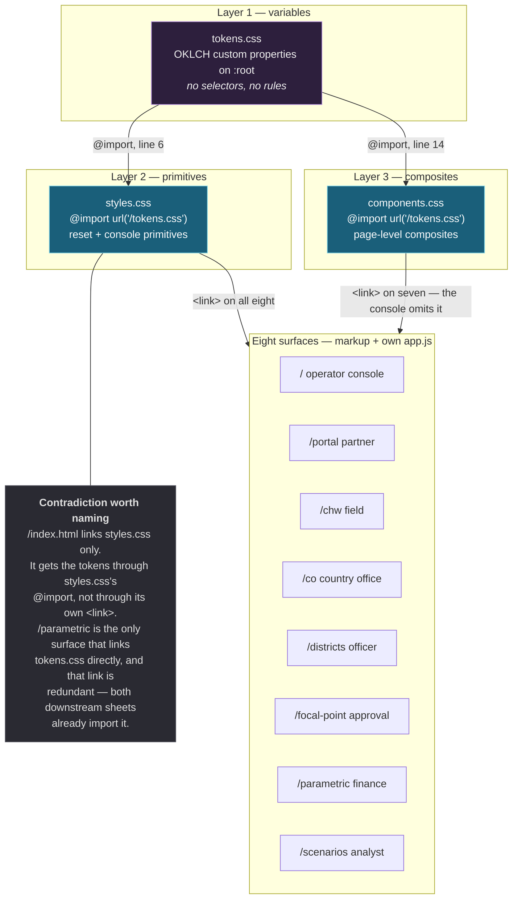
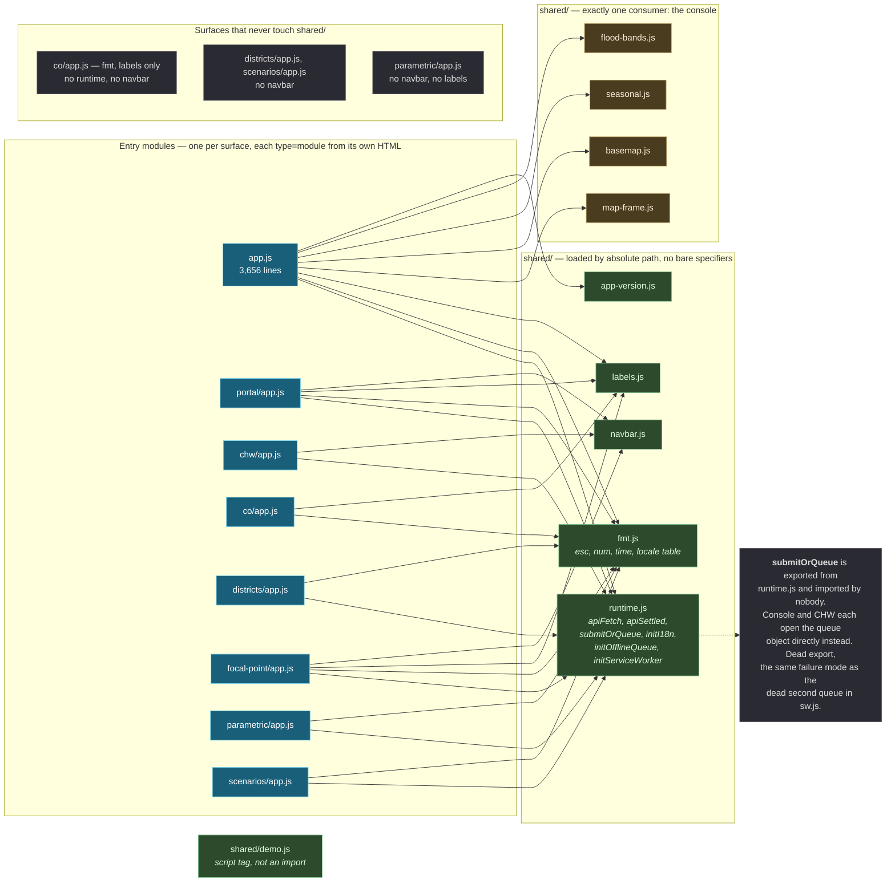
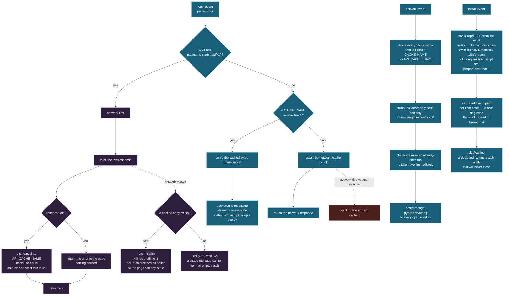
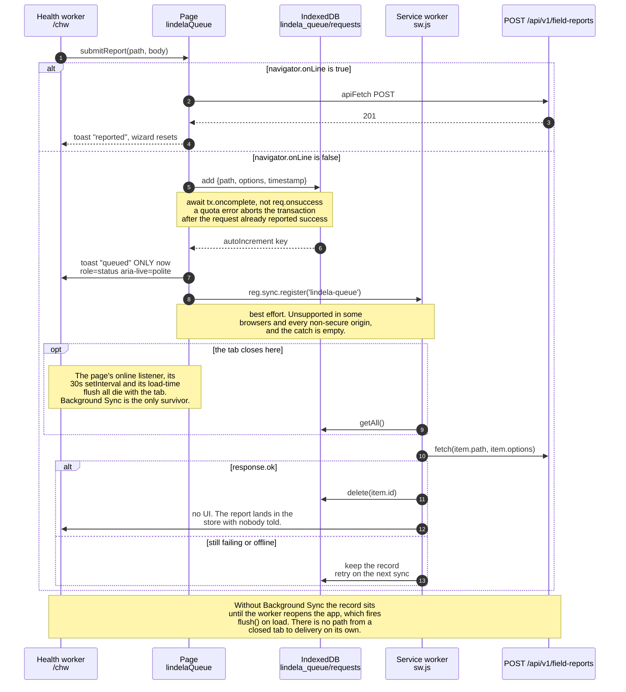

# Frontend

Eight static applications under `public/`, served with no build step and **zero
front-end dependencies**. No bundler, no framework, no transpiler, no package.json
in `public/`, no import map. Every byte a browser runs is a file that exists in the
repository.

That constraint is load-bearing. It is what lets a district office serve the
product from a laptop with `node src/server.js` and nothing installed, what makes a
deployed fix a file copy rather than a build, and what makes the service worker's
precache list derivable rather than authored. It also costs everything a framework
would have supplied — routing, state, components — and most of this document is
about what the code does instead.

Read [system-overview.md](system-overview.md) §5 first for the placement of these
surfaces in the wider system, and [deployment.md](deployment.md) for what actually
runs them.

---

## 1. The eight surfaces

| Route | Audience | Offline | Writes |
|---|---|---|---|
| `/` | Operator console — dispatch, situation map, alert triage | shell only | yes (queueable) |
| `/portal` | Partner, read-only | shell only | no |
| `/chw` | Community health worker | **full** | yes (queueable) |
| `/co` | Country office — quarterly reporting, PDF export | shell only | no |
| `/districts` | District officer — one district | shell only | no |
| `/focal-point` | Focal point — the approval gate before finance releases | shell only | yes |
| `/parametric` | Finance — trigger rules, disbursement | shell only | yes |
| `/scenarios` | Analyst — what-if | shell only | no |

They are separate applications. There is no client-side router, no shared shell that
survives navigation, and no shared entry module. Each `index.html` loads its own
`app.js` with `<script type="module">`, and each `app.js` runs its own boot
sequence at import time. Navigating between surfaces is a full document load.

The separation is a design decision, not an accident of packaging. The CHW app is
built for a shared phone held in one hand with no signal; forcing it to match the
console's feature set would make it worse at the one job it has. See
[system-overview.md](system-overview.md) §5.

### What the console is

`public/app.js` is 3,656 lines — larger than every other surface combined — because
it carries the situation map, twelve polled panels, alert triage and dispatch.
`public/index.html` is the only surface with an inline `<style>` block of
consequence, and the only one that does not link `components.css`.

## 2. The CSS cascade: tokens → styles → components

Three sheets, each one layer above the last, each one importing the one above it so
that a surface only has to link the last sheet it needs.



**`tokens.css`** is 111 lines of `:root` custom properties in OKLCH. It declares no
rules, so it has no cascade position and cannot be overridden by specificity games
from a later sheet — only by a later `:root` block. Dark only: there is no light
theme, because every surface in this product is used in a room without daylight or
on a phone at 6am. The comments record why individual values moved; `--ink-faint`
was raised from 55% L because it measured 3.6:1 on `--surface` and carries "never
run" and "unknown", the two states an operator most needs to read.

**`styles.css`** (2,224 lines) is the console's primitive layer — reset, body
typography, the scroll container, buttons, inputs, tables, dialogs, the RTL block.
It opens with `@import url('/tokens.css')`, which is what makes the cascade work:
a surface that links only this sheet still resolves every token.

One rule in it is worth naming because it caused a bug in two surfaces:

```css
/* The scroll container every page needs.
   This rule did not exist and `body` carried `overflow: hidden`, so the two
   surfaces that link this sheet but have no inner scroller — parametric and
   scenarios — clipped their own tables: the parametric Disbursement History
   lost its last column off the right edge with no scrollbar and no way to
   reach it. Every other page escaped this only by not linking the sheet. */
main {
```

The comment is right that the other pages escaped by accident.

**`components.css`** (781 lines) is the composite layer — cards, rails, badges,
chips, stat tiles, tables as they appear in a page rather than in a document. Its
own header comment records why it exists: seven of the eight surfaces carried
236–326 lines of inline `<style>` re-declaring the reset, body, header, footer,
buttons, tables, inputs and dialogs; two pages had three different spellings of
danger red and one had a light palette on a dark page.

**Note the direction of the dependency.** Components are built *on* primitives, not
the reverse. `styles.css` knows nothing about `components.css`; `components.css`
knows nothing about any surface. The layers are one-directional, which is why a
surface can link the first two and skip the third.

### The console's omission is real, not cosmetic

`/index.html` links `/styles.css` and nothing else. Every other surface links both
`/styles.css` and `/components.css`; only `/parametric` additionally links
`/tokens.css`, redundantly. The console therefore has the token layer and the
primitive layer but not the composite layer — it is the one surface still carrying
its own page-level composite CSS inline. If a component is added to
`components.css`, seven surfaces gain it and the console does not.

## 3. The ES module graph

Modules are imported by **absolute path** (`/shared/fmt.js`), never as bare
specifiers. There is no import map, so there is nowhere for one to live.



Three things to take from it:

**`shared/` overstates the sharing.** `map-frame.js`, `basemap.js`, `seasonal.js`
and `flood-bands.js` have exactly one consumer: `public/app.js`, the console. They
are factored out because each is a pure function worth testing directly —
`test/map-frame.test.js`, `test/flood-bands.test.js` and `test/seasonal.test.js`
import them in a bare Node process, which `app.js` cannot be, because it runs its
boot sequence at import time. That is the reason for the split: testability, not
reuse. `public/app.js` is the only module in the tree that cannot be imported
without a DOM.

**Four surfaces skip `runtime.js` entirely.** `co`, `districts`, `parametric` and
`scenarios` fetch without `apiFetch` in at least some paths — `co` and `districts`
import only `fmt.js` and `labels.js`. `runtime.js`'s own comment records what that
cost: the copies that skipped `res.ok` treated the service worker's 503 offline
fallback as a valid body, so a disconnected console rendered silently stale data
with no error shown.

**`navbar.js` reaches five surfaces, not eight.** `co`, `districts`, `parametric`
and `scenarios` do not import it, which means four surfaces have no shared top bar
and no shared cross-surface navigation.

**`demo.js` is not a module import.** It is a second `<script type="module">` on
all eight surfaces, independent of each `app.js`. It implements `?demo=1`, the
guided tour.

## 4. The map

The situation map is hand-rolled SVG in `public/app.js`. **There is no mapping
library** — no Leaflet, no MapLibre, no D3, nothing. The whole implementation is
roughly 200 lines.

- **`viewBox="0 0 800 500"`**, `preserveAspectRatio` default (`xMidYMid meet`), on
  an `<svg>` element that is fluid. `SVG_W = 800`, `SVG_H = 500` in JS match it.
- **`svgEl(tag, attrs)`** creates elements with
  `document.createElementNS('http://www.w3.org/2000/svg', tag)`. `createElement`
  would produce HTML-namespaced nodes that render nothing.
- **`project(lat, lon, bbox)`** is equirectangular:
  `x = (lon − minLon) / (maxLon − minLon) × 800`,
  `y = (maxLat − lat) / (maxLat − minLat) × 500`,
  rounded to one decimal. The default bbox is East Africa, `minLat −2 / maxLat 12 /
  minLon 29 / maxLon 46`. It is a plate carrée with no projection library and no
  datum handling; at this extent the distortion is small enough not to matter and
  the arithmetic is inspectable.
- **Pan and zoom** mutate a single `transform` attribute on `#mapTransform`.
  Wheel zoom, pointer drag, and a keyboard path (§6).
- **Layers** are separate `<g>` elements — ocean, land, districts, graticule,
  hazards — each repainted independently.

The consequence of a fixed viewBox on a fluid element is stated in the code and is
worth repeating: `viewBoxUnitsPerPx` exists because the viewBox is 800 units wide
regardless of rendered width, so **24 viewBox units is 24 CSS px on a desktop and
about 8 px on a phone in the field**. Every radius in the map is computed in viewBox
units through this function, because a constant radius would be a five-pixel dot in
Turkana.

Basemap tiles come from AWS Terrarium, fetched by URL and drawn as `<image>` under
the hazard layer. That fetch is deliberately unauthenticated — see
[system-overview.md](system-overview.md) §6 for why an unexpired key matters less
than a key that dies mid-crisis.

## 5. A control that does nothing is worse than no control

The map was `role="img"` with wheel-and-drag pan, wheel zoom and click-only marker
drill-down, and **there was no `tabindex` anywhere in the entire codebase**. A
keyboard or screen-reader user could not open a single hazard, asset or IPC area —
on the primary decision surface of both officer-facing pages. Commit `17a3973`
fixed it: `tabindex`, arrow-key pan, `+`/`−` zoom, `0` reset, `t` for the text
alternative, and an `aria-live` region announcing the zoom level.

The pattern generalises, and the codebase records three instances:

| Instance | What was dead | Consequence |
|---|---|---|
| `sw.js` second queue | A queue in database `lindela-queue` that nothing wrote to and no sync tag was registered for | Two implementations, one dead, **neither replaying** — a queued report sat in IndexedDB until the tab closed |
| `runtime.js` `initServiceWorker` | Exported, imported by nobody; the console and focal-point each hand-rolled `navigator.serviceWorker.register('/sw.js')`, and focal-point *also* called the shared one | Two registrations for one worker, which the browser silently deduplicated — **the bug hid behind working code** |
| `demo.js` `activateTabIfNeeded` | `document.querySelector('[data-tab=…]')` returns null on any surface without that tab, and the guard is `if (btn && typeof btn.click === 'function')` with no `else` | The guided tour silently does nothing on a surface it cannot steer |

The third is the general shape. **A control that is present, focusable, announced,
and inert is worse than an absent one**, because an absent one tells the operator
the capability is not there. The failure is not that nothing works; it is that
everything *looks* like it works.

This is also why the accessibility gate exists as a separate process rather than as
assertions inside the browser suite: `check-dashboard-browser.mjs` drives every
surface with `element.click()` from `Runtime.evaluate`, which bypasses the entire
keyboard path, and counts zero occurrences of `focus`, `role=`, `tabindex` or `alt`
across its 890 lines. A page can pass the whole suite while being unusable by
keyboard. (`element.click()` is exactly how `demo.js` steers the tabs, so the tour
drives the mouse path and never the keyboard one.)

## 6. Offline

### The service worker's job

`public/sw.js` (367 lines) is a single classic worker. It is registered by
`runtime.js initServiceWorker` on the console and focal-point, and hand-registered
where `runtime.js` is not imported. It does four jobs: precache the shell, serve
API responses, register the platform, and replay the offline queue.



### Precache is derived, not authored

This is the most important thing in `sw.js` and the least obvious from reading it.

`ENTRY_PATHS` is eight strings — the eight `index.html` files. Everything else is
computed. `shellGraph(load, origin)` does a breadth-first walk from those entry
points plus `BOOTSTRAP_ASSETS` (`/sw.js`, `/icon.svg`, `/manifest.webmanifest`,
`/i18n/en.json`), and for each fetched file runs five regular expressions covering
`<link href>`, `<script src>`, `@import`, `from '…'`, and bare `import '…'`. It
drops cross-origin references and everything under `/api/`. The result is the
precache manifest.

**Why it matters:** a missing ES module is a hard module-resolution error, not a
degraded load. The console fails to boot *entirely* — the one case the offline work
exists for. The precache list used to be hand-written, and a hand-written list of an
import graph is wrong the moment anyone adds an import. It omitted all seven
`/shared/*.js` modules `app.js` needs, then `/shared/fmt.js`, `/shared/labels.js`
and `/components.css` after someone repaired it by hand. Each repair was a snapshot;
each snapshot a chance to forget.

`cache.add()` rejects per item, so a single unfetchable asset costs one entry rather
than the whole shell. That is a deliberate trade and it has a sharp edge: a worker
that installs with a hole in its cache will **never** be repaired, because the next
install only runs on a `CACHE_NAME` bump.

`sw.js` guards its own worker globals:
`const SW = typeof self === 'undefined' ? null : self`, with optional-call
`SW?.addEventListener(...)`. This exists so `test/web-chw-offline.test.js` can
import the module and run `shellGraph` against the real files on disk with a loader
that reads `public/` — the reason the precache list is checked against anything at
all.

### Two cache buckets, on purpose

`CACHE_NAME = 'lindela-lite-v4'` holds the shell. `API_CACHE_NAME =
'lindela-lite-api-v1'` holds API responses. Separate buckets so the API cache can be
expired by age without discarding the shell, and so the shell stays small enough to
version cheaply. Mixing them means a 200-entry API cache has to be versioned on the
same clock as the code.

`API_TTL_MS` is 24 h, `API_MAX_ENTRIES` is 200. The console polls twelve endpoints
every thirty seconds; cached into the shell bucket with no bound that grows without
limit and **survives logout**, because nothing tied the lifetime of an operational
record to the session that read it.

**Where the pruning is weaker than it reads.** `pruneApiCache` runs on `activate`
only — not after each write — and returns immediately if `keys.length <=
API_MAX_ENTRIES`. Inside it, the first loop deletes the oldest `excess` entries *only
if each is undated or older than the TTL*; if entries are all fresh and over the
cap, none is deleted. The second loop is then meant to force the cap, but
`remaining` is computed as `keys.length - excess`, which is exactly
`API_MAX_ENTRIES` by construction, so `remaining - API_MAX_ENTRIES` is `0` and the
loop never executes. **The 200-entry cap is therefore a soft trigger for a prune
attempt, not a bound**, and a console left open for days with a fresh cache can grow
the API bucket past 200 until an `activate` finds entries old enough to drop.

### Updates reach open tabs

`install` → `skipWaiting()`. `activate` → `clients.claim()`. Without both, a new
worker installs and waits while the previous one keeps serving until every tab for
the origin closes — on a long-lived ops console that is effectively never, so a
deployed fix never reached the operator it was deployed for. `activate` also
`postMessage({type:'activated'})` to every open window so the page can offer a
reload rather than swapping under a user mid-dispatch.

## 7. The offline queue

Two writers, one store. `runtime.js initOfflineQueue` opens IndexedDB database
`lindela_queue` v1, object store `requests` with `keyPath: 'id', autoIncrement`.
`sw.js replayQueue` opens the **same** database by the **same** name and replays
what it finds. That is the whole design: one set of pending requests, so the page
and the worker cannot disagree about what is outstanding.



**The write path is where the honesty is.** `enqueue()` resolves on
`tx.oncomplete`, not `req.onsuccess`, and rejects otherwise. This is not pedantry:
a quota error or constraint violation aborts the transaction *after* the request has
already reported success, so a record the store then drops must not read as saved.
`enqueue()` also throws when there is no IndexedDB at all — private mode, storage
pressure, a blocked upgrade — rather than resolving. The comment in the source is
the design rationale: **a queued report is a report the user still has to send, and
the only way to say so honestly is for the store to confirm it before anyone is told
anything.**

`chw/app.js queueReport` then requires `{ queued: true }` before showing the toast.
Commit `aaac84f` fixed the case where it showed "Report queued", reset the wizard,
and the report existed nowhere.

### Who actually uses it

Both the console (`app.js initOfflineQueue`, `queueRequest`, `pendingCount`,
`flush`) and CHW (`chw/app.js`) drive the queue end to end. The console renders a
live "N queued" badge driven by the `lindela-queue-changed` and
`lindela-queue-flushed` events; CHW shows the count on its home screen. The other
six surfaces never call `initOfflineQueue` — they are read-only or their writes are
narrow enough that offline would not help.

**`submitOrQueue` is exported and imported by nobody.** It is the intended public
entry point for exactly the flow above (`online → apiFetch`, `offline → enqueue`),
and both surfaces open `window.lindelaQueue` directly instead. The duplicate is
harmless today because the two callers pass the same shapes, but the export is the
one that will drift.

### What Background Sync does and does not buy

`enqueue()` calls `navigator.serviceWorker.ready` then `reg.sync.register('lindela-queue')`
inside a `try` with an empty `catch`. The page also flushes on `online`, on a 30 s
`setInterval`, and once at load. None of those fire if the tab is closed, which is
the case Background Sync exists for and which the source calls normal rather than an
edge case.

Background Sync is not universally available — not in Safari, and not on any
non-secure origin. A deployment served over plain HTTP on a LAN has no Background
Sync and no warning that it has none. In that configuration the queue still drains,
but only when the health worker next opens the app. That is stated here rather than
left to be discovered.

## 8. Internationalisation

Ten locales ship: `en`, `sw`, `so`, `am`, `fr`, `pt`, `din`, `km`, `nk`, `ar`.
`public/i18n/<locale>.json`; `initI18n(locale)` fetches one and merges.

`lang` and `dir` are set at runtime from `LOCALE_INFO` in `fmt.js`, via
`applyLocaleToDocument(locale)`, on **every switch**, not just at load. `ar` is the
only `rtl: true`. Setting only one of `lang` and `dir` is how a page ends up
declaring Arabic content with a left-to-right layout, which is worse than not
offering Arabic at all because it looks finished.

The catalogue is re-based on English on every switch: `set()` re-reads `/i18n/en.json`,
clears the catalogue, applies the base, then overlays the target locale. The
alternative — merging into whatever was already there — meant `en → so → fr` left
Somali strings behind for every key French did not define. Switching was neither
idempotent nor reversible. English is the base layer and an untranslated key falls
back to it, which is why partial coverage is acceptable at all.

`labels.js` maps domain field names to English display names. `metricLabel` turns
`precipitation_mm` into "Rainfall (mm)". Its header comment records why: a focal
point approving a trigger that releases money was shown `Metric precipitation_mm /
Threshold 40` with the number right and the meaning withheld from the person who had
to act on it. An unmapped key falls through to a humanised form of itself rather
than disappearing, so a new backend field is legible on arrival instead of looking
like a bug.

### The picker is reconciled against reality

`scripts/check-i18n-offers.mjs` reads every `public/i18n/*.json`, maps namespaces to
surfaces, and fails if a surface offers a locale it cannot render. The floor is
**25% of that surface's own keys**, not 100%.

The audit that produced it found three surfaces breaking the promise: `districts`
and `scenarios` carried a ten-language picker over pages with zero i18n attributes;
`co` offered Arabic, French and Portuguese against a `co.*` namespace where those
three were 0% translated; `focal-point` offered French and Portuguese at 0%. The
same defect was found on the CHW app, fixed there, and reintroduced twice
elsewhere — which is why it is a gate and not a convention.

## 9. Gates

Two browser-driven gates, both over Chrome DevTools Protocol, both needing Chrome on
`:9222` and a server on `:4177`. Neither runs in CI.

**`scripts/check-responsive.mjs`** — 8 surfaces × 3 viewports (360, 414, 768). Per
combination it measures three things and passes only if all three hold: horizontal
overflow ≤ 1 px, zero clipped text, zero targets under 24 CSS px. 24 × 24 is WCAG
2.2 SC 2.5.8 Target Size (Minimum).

Its selector is `'button, input:not([type=hidden]), select, textarea,
[data-tap-target]'`. The `[data-tap-target]` clause was added by commit `46ac6d4`
after the gate was found measuring **no SVG shape at all**: a hazard marker could
be five CSS pixels across and the gate stayed green, on a surface that had already
opted in with `data-tap-target` (`public/app.js:1447,1476,1517`). That commit also
added the width check, because a 20 × 30 control is as untappable as a 30 × 20 one.

**`scripts/check-a11y.mjs`** — 12 assertions × 8 surfaces = 96, all passing:
`h1`, `main`, `skip`, `headings`, `forms`, `images`, `tables`, `contrast`,
`firstTab`, `focusVisible`, `reducedMotion`, `zoom`. It runs at 1440 × 900 for
structure and contrast, 320 × 640 for reflow, and under
`Emulation.setEmulatedMedia` with `prefers-reduced-motion: reduce`.

The 320 px pass is deliberately not in the responsive gate. WCAG 1.4.10 asks for no
horizontal scrolling at 320 CSS px, which is a 1280 px screen at 400% zoom —
`check-responsive` measures 360/414/768 and would miss it entirely.

### Both clear the service worker and the browser cache first

```js
await session.send('Network.clearBrowserCache')
await session.send('Network.setCacheDisabled', { cacheDisabled: true })
await session.send('Page.navigate', { url: BASE + '/' })
await sleep(600)
await call(session, async function () {
  if (navigator.serviceWorker) {
    for (const reg of await navigator.serviceWorker.getRegistrations()) await reg.unregister()
  }
  if (window.caches) for (const key of await caches.keys()) await caches.delete(key)
  return true
})
```

**This is the step that costs the hours.** The service worker answers static assets
stale-while-revalidate: it serves the cached `app.js` immediately and refreshes in
the background. Left in place, the gate measures whatever build was cached first —
a deliberate break in a surface's HTML still reports PASS. Worse, the teardown is
asynchronous: `Runtime.evaluate` with `returnByValue: true` and no `awaitPromise`
serialises the pending promise as `{}`, the registrations and cache entries survive,
and the gate confidently measures the old build. `check-dashboard-browser.mjs`
documents losing several debugging cycles to exactly this.

Two smaller instances of the same lesson in this tree: a precache entry missing one
module is a hard boot failure (§5), and `--ink-faint` at 55% L measured 3.6:1 in a
gate that had been reading token *names* rather than computed ratios.

## 10. Constraints, stated so they are not rediscovered

| Constraint | Consequence for a change |
|---|---|
| No bundler, no npm in `public/` | An import must be a real absolute path to a file that exists, or the surface does not boot |
| No bare specifiers, no import map | `import x from './y'` works only relative to the importing file's own URL |
| `app.js` runs at import time | It cannot be imported by a test. Extract a pure function to `shared/` to test it — that is what the four single-consumer modules are for |
| The precache graph is derived at install | Adding an import is safe. Adding a file fetched by URL is not — it must go in `BOOTSTRAP_ASSETS` |
| `CACHE_NAME` is version-bumped per release | A shell asset that is neither imported nor in `BOOTSTRAP_ASSETS` never reaches an offline device |
| `apiFetch` is the only HTTP call | A surface that skips it loses `res.ok` checking, the 20 s timeout, abort-signal composition, and `err.offline` |
| `<html dir>` is set at runtime | Markup must not hardcode `dir="ltr"` |
| Tokens are the only colour source | A hardcoded hex bypasses the token layer and the contrast gate will not see the intent |

## 11. Unresolved

Recorded because a reader who hits them by reading code will assume a bug, and some
of them may be.

- **`submitOrQueue` is dead.** Exported, documented, imported by nobody. Both
  writers open `window.lindelaQueue` directly. Whether the export or the two call
  sites should go is a call, not a fact in the code.
- **The API cache cap is soft.** `pruneApiCache`'s second loop is unreachable
  (`remaining - API_MAX_ENTRIES` is always 0) and its first loop is age-conditional,
  so a fresh over-cap cache is not evicted. Whether that is intended or a
  transcription error is not recorded anywhere.
- **`/co` and `/districts` fetch without `apiFetch`.** `runtime.js`'s comment names
  this as the defect `apiFetch` was extracted to fix, and both surfaces still do not
  import it. Whether the remaining call sites are audited is not stated.
- **Four surfaces have no shared navbar.** `co`, `districts`, `parametric` and
  `scenarios` do not import `navbar.js`. Whether that is deliberate — these are
  deep-link surfaces with their own chrome — or an omission is not recorded.
- **The console does not link `components.css`.** Whether that is deliberate or a
  leftover from before `components.css` existed is not recorded.
- **Background Sync availability is not surfaced.** The `reg.sync.register` catch is
  empty by design, so a deployment with no Background Sync has no signal that queued
  reports will only drain when the app is reopened.
- **Neither browser gate runs in CI.** `check-responsive` needs Chrome on `:9222` and
  a server on `:4177`; commit `46ac6d4` explicitly records that its selector fix was
  **not verified live**, only reasoned about.
- **The offline queue is unbounded and unordered.** `enqueue` has no size cap and
  `replayQueue` iterates `getAll()` in key order, so a report filed while offline
  for a week is replayed oldest-first against a live store, and a device that never
  reconnects accumulates without limit.

## 12. Continue

- [deployment.md](deployment.md) — what runs this, and what to do when it is down
- [request-lifecycle.md](request-lifecycle.md) — what the API does with what these
  surfaces send it
- [ingestion.md](ingestion.md) — where the console's twelve panels get their data
- [system-overview.md](system-overview.md) §5–§7 — placement, and what the shape does
  not do