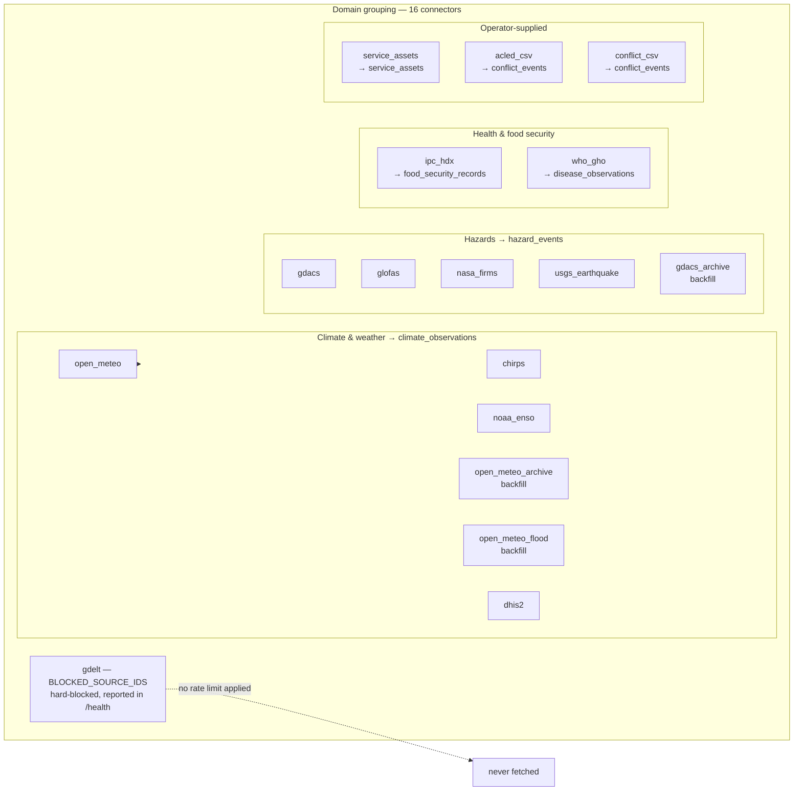
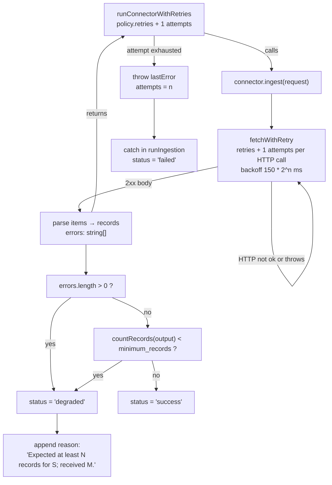

# Ingestion

How an external HTTP response becomes a row in `lite_records`, and what happens
when it does not.

The dangerous failure mode in ingestion is not a crash. It is a connector that
fetches successfully, parses nothing, and reports success — a dashboard then shows
"no flood forecast" where the truth is "we stopped receiving floods". Several of the
guards below exist only because that already happened.

## Trigger paths

There is **no in-process timer**. Nothing in `src/` calls `setInterval` to drive
ingestion. Recurrence is external, which means it can be turned off by stopping a
container rather than by a config flag, and which means an API key is on the hot
path.

| Path | Handler | Notes |
|---|---|---|
| `POST /api/v1/ingest/run` | `src/server.js:353` → `runIngestion` | Body may carry `sources`, `timeout_ms`, `retries`. Defaults to `PUBLIC_INGESTION_SOURCES`. |
| `POST /api/v1/ingest/run-due` | `runDueIngestionSchedules` (`src/ingestion.js:245`) | The scheduled path. Driven by the compose sidecar every 900 s (`docker-compose.yml:60`, `LINDELA_LITE_SCHEDULER_INTERVAL_SECONDS`). Only schedules with `status === 'active'` and `next_run_at <= now` run (`ingestionScheduleIsDue`). |
| `POST /api/v1/ingest/schedules/{id}/run` | `src/server.js:982` | Runs one schedule immediately, ignoring `next_run_at`. |
| `POST /api/v1/service-assets` | `src/server.js:415` | **Implicit fourth path.** The body *is* the connector input; it calls `runIngestion(store, { ...body, sources: ['service_assets'] })`, so a request-body boolean gates the run, not a route check. |

`run-due` fires `runIngestion` once **per due schedule**, each with `sources: [schedule.source]`
(`src/ingestion.js:251`). Nine default schedules means nine separate single-source
`runIngestion` calls, each with its own `merged` accumulator and its own write.

## The connector contract

`defineConnector({ id, description, schema, defaults, ingest })` in
`src/connectors/spec.js:18`. The returned spec is frozen and validates `id`,
`description`, `schema`, `defaults`, and that `ingest` is a function.

`ingest(options)` returns `Promise<{ <collection>: Record[], errors: string[] }>`.

There are 16 connectors (`CONNECTORS`, `src/ingestion.js:20`), matching the 16
entries in `connectors.registry.json`.

## Sources

Sources run **sequentially** in a `for` loop (`src/ingestion.js:114`), never
concurrently. Consequences: a full default run's wall-clock is the *sum* of every
source's latency, and one slow source delays every alert downstream of it. The
`duration_ms` recorded per run is that source's own slice.

The nine sources in `PUBLIC_INGESTION_SOURCES` are the default run set. The three
archive backfills are deliberately excluded from it (`src/ingestion.js:49`):
`gdacs_archive` is a quarter-by-quarter crawl of 40 years, and putting it on a
recurring schedule would be abuse of a free service. They carry
`interval_minutes: 0` and `regular: false`, and `computeNextIngestionRunAt` returns
`null` for a zero interval (`src/ingestion.js:281`), so a default-seeded schedule can
never pick them up.



Marks that matter more than the grouping:

- **`glofas` is broken.** Its RSS URL serves the EFAS single-page app, not a feed.
  The connector detects this with `looksLikeFeed(text)` and pushes a descriptive
  error rather than reporting an empty success (`src/connectors/glofas.js:20`).
  Every run is `degraded` with zero records. It stays in the default set.
- **`gdelt` is hard-blocked** in `BLOCKED_SOURCE_IDS` (`src/schema.js:20`);
  `getConnector` and `runIngestion` both throw on it, and `/api/v1/health` reports
  it under `exclusions` (`src/server.js:268`). It has no connector and no code path.
- **`acled_csv` is gated on a request-body boolean**, not a verified licence
  (`src/connectors/uploads.js:35`). `acled_license_accepted: true` in the POST body
  is the entire gate; the data is user-supplied and the record carries
  `license: 'user_supplied_acled_license'`.
- **`rateLimit.perMinute` is declared and never enforced.** Every spec carries it
  (`src/connectors/glofas.js:79` and 12 others) and `connectors.registry.json`
  repeats it. Nothing reads it. There is no throttle, limiter, or token bucket
  anywhere in `src/`. It is documentation shaped like configuration.

## The two retry layers

These are independent and they multiply.

`fetchWithRetry` (`src/connectors/http.js:1`) wraps a single HTTP request:
`retries + 1` attempts, backoff `150 * 2^attempt` ms, 20 s default timeout,
`AbortSignal.timeout`.

`runConnectorWithRetries` (`src/ingestion.js:318`) wraps the whole connector:
`policy.retries + 1` attempts, backoff `min(1000 * 2^attempt, 5000)`.

Worst case for `open_meteo` (`retries: 2`) is **9 HTTP attempts across 3 connector
attempts**. A connector that loops internally — `gdacs_archive` paginates — multiplies
that again.



Status resolution is three-valued (`src/ingestion.js:128`):

- **`failed`** — the connector threw after all retries. No records.
- **`degraded`** — it returned, but with any `errors`, **or** fewer than
  `minimum_records`. Under-count appends a human-readable reason to the error list.
- **`success`** — no errors and the record count met the floor.

`minimum_records` is `1` for every remote source and `0` for the operator-supplied
and `dhis2` ones (`SOURCE_POLICIES`, `src/ingestion.js:55`). The comment records why:
with `0`, a connector that silently parses nothing still reports success, "which is
how CHIRPS, GloFAS, and NASA FIRMS all hid broken ingestion."

## Known defect: `countRecords` under-counts, and two collections are exempt from the floor

`countRecords` (`src/ingestion.js:334`) sums only:

```
climate_observations, hazard_events, conflict_events, service_assets
```

It omits **`food_security_records`** and **`disease_observations`**, which the merged
accumulator at `src/ingestion.js:110` does carry. Two consequences, both wrong in the
direction that hides failure:

1. **`ipc_hdx` and `who_gho` can never report `success`.** Both connectors write only
   to a collection `countRecords` does not sum, so their count is *always* `0`, and
   `0 < minimum_records: 1` is always true. A healthy run that ingests 500 IPC
   classifications reports `status: 'degraded'` with
   `"Expected at least 1 records for ipc_hdx; received 0."` — a confident, specific,
   and false statement. The floor cannot distinguish "returned nothing" from "returned
   plenty"; for these two sources it is a constant that always fires.
2. **`records_processed` under-reports for every source.** The number shown in run
   history is a partial sum. A successful `who_gho` run ingesting 200 disease
   observations records `records_processed: 0`.

The direction matters. `ingestionStatus` derives health from the latest run, and
`ipc_hdx` / `who_gho` are therefore permanently `degraded` or `stale` — permanently
raised as broken sources by the one check meant to catch silently broken ones.

`countRecordsByCollection` (`src/ingestion.js:340`) has the identical omission, so
`diagnostics.records_by_collection` also omits both collections. The top-level
`counts` returned from `runIngestion` (`src/ingestion.js:201`) omits them too.

## Known defect: every lineage record in a batch describes the whole batch

`src/ingestion.js:186`:

```js
for (let i = 0; i < source_runs.length; i++) {
  const run = source_runs[i]
  const allRecords = [
    ...merged.climate_observations,
    ...merged.hazard_events,
    ...merged.conflict_events,
    ...merged.service_assets,
  ]
  const lineageRecord = recordLineage(store, run, allRecords)
  data_lineage.push(lineageRecord)
}
```

`allRecords` is invariant across the loop — it is the *final* merged state of all
sources, computed after every source has already run. Every lineage record in a batch
therefore carries:

- the full concatenated `payload_hashes` of **all** sources, not its own,
- the same `upstream_checksum` (`canonicalHash({ hashes })`) as its siblings, since
  `recordLineage` derives it solely from those hashes (`src/lineage.js:6`),
- `record_count` equal to the batch total,
- and only `source` / `source_run_id` / `retrieval_time` to distinguish it.

Lineage cannot currently answer "which records did *this* source produce?" — the
honest reading is that each record is a batch checksum with a source label attached.
Downstream, this makes `upstream_checksum` useless for identifying a divergent run
of a single source: it only detects that *something* in the batch changed.

`upstream_url_or_endpoint` is hardcoded `null` (`src/lineage.js:13`).

## Idempotency

Two mechanisms, both needed:

- **`canonicalHash(record)` → `record.payload_hash`**, assigned in `runIngestion` if
  the connector did not set it (`src/ingestion.js:147`). This is *content* identity:
  the same upstream record fetched twice hashes the same and is recognised as
  unchanged.
- **`stableId(...)`** in each connector gives a deterministic `id` from source and
  natural key (e.g. `stableId('hazard', ['glofas', link, title])`). This is *entity*
  identity across updates.

`mergeById` (`src/store.js:100`) keys on `id`, and skips an incoming record whose
`payload_hash` is already in the collection — a no-op re-fetch costs no rows.
Otherwise it merges `{ ...existing, ...incoming }`, so a corrected upstream value
overwrites. Records are then sorted by `recordTimestamp`, which walks a fixed
precedence of date fields and falls back to `''`.

`first_seen_at` is stamped once, at first ingest (`src/ingestion.js:149`), and is
never refreshed on later merges.

`postgres-store.js` mirrors this in SQL with a unique index on
`(collection, payload_hash)` (`src/postgres-store.js:52`).

## End-to-end

```mermaid
sequenceDiagram
  autonumber
  participant SB as scheduler container
  participant API as POST /api/v1/ingest/run-due
  participant RI as runIngestion
  participant CW as runConnectorWithRetries
  participant CN as connector.ingest
  participant HT as fetchWithRetry
  participant LN as recordLineage
  participant ST as store.merge

  SB->>API: "curl -fsS -X POST (every 900 s)"
  API->>RI: "one call per active due schedule"
  RI->>RI: "validate sources against SOURCE_IDS and BLOCKED_SOURCE_IDS"
  loop sources sequentially, never concurrently
    RI->>CW: "connector + policy (timeout_ms, retries)"
    loop attempts <= policy.retries
      CW->>CN: "ingest(request)"
      CN->>HT: "one or more HTTP GETs"
      HT-->>CN: "2xx body, or throw after retries + 1"
      CN-->>CW: "{ collection: records[], errors: string[] }"
    end
    alt threw on every attempt
      CW-->>RI: "throw lastError (attempts = n)"
      RI->>RI: "status = failed; errors = [message]"
    else returned
      CW-->>RI: "output + __attempts"
      RI->>RI: "countRecords(output) vs minimum_records"
      RI->>RI: "status = degraded if errors or under-count, else success"
      RI->>RI: "stamp payload_hash and first_seen_at on each record"
    end
    RI->>ST: "records buffered in merged, not written yet"
  end
  loop once per source_run — SAME array each time
    RI->>LN: "recordLineage(store, run, allRecords)"
    LN-->>RI: "record: batch payload_hashes + batch checksum"
  end
  RI->>ST: "merge({ ...merged, source_runs, data_lineage })"
  ST->>ST: "mergeById — skip seen payload_hash, else overwrite by id"
  ST-->>RI: "data"
  RI-->>API: "{ source_runs, counts, data }"
```

Note the write boundary: `store.merge` happens **once, at the end**. A process killed
mid-run leaves no partial records from the sources that already succeeded — their
`source_runs` are lost with them.

## Idempotency of a run itself

`source_runs[].id` is `stableId('run', [source, startedAt, status, errors])`
(`src/ingestion.js:161`). It includes the wall-clock `startedAt`, so two runs of the
same source in the same millisecond with the same outcome collapse, and two runs a
second apart never collapse. Run history is append-only in practice.

## Errors and observability

Every run emits `metrics.counter('ingestion_runs_total', { source, status })` and
`metrics.histogram('ingestion_duration_ms', durationMs, { source })`
(`src/ingestion.js:181`). Note that the counter is emitted for `failed` and
`degraded` alike — there is no separate error counter.

`ingestionStatus(data)` (`src/ingestion.js:286`) derives per-source health:
`never_run` → `failed` → `stale` (older than `stale_after_minutes`) → `degraded` →
`fresh`. Staleness is checked *before* `degraded`, so a degraded run that also aged
out reports `stale` and the degradation is only visible on the run itself.

`stale_after_minutes` is set per source and is not uniform: `gdacs` 180,
`open_meteo`/`glofas` 360, `chirps`/`noaa_enso` 1440, `ipc_hdx` 2880, `who_gho`
20160 (14 days). The WHO window is long because it publishes annually — "stale" there
means something broke, not that the data is old.

## Unresolved

- `recordLineage(store, ...)` takes `store` and does not use it. Whether the intent
  was per-source records, or a store-side digest, is not recoverable from the code.
- `recordTimestamp` falls back to `''`, so records with no recognised date field sort
  to the end deterministically but silently. Whether that is intended is not stated.
- `runDueIngestionSchedules` returns an `analytics` array of full ingestion results
  that no caller in `src/` appears to consume.
