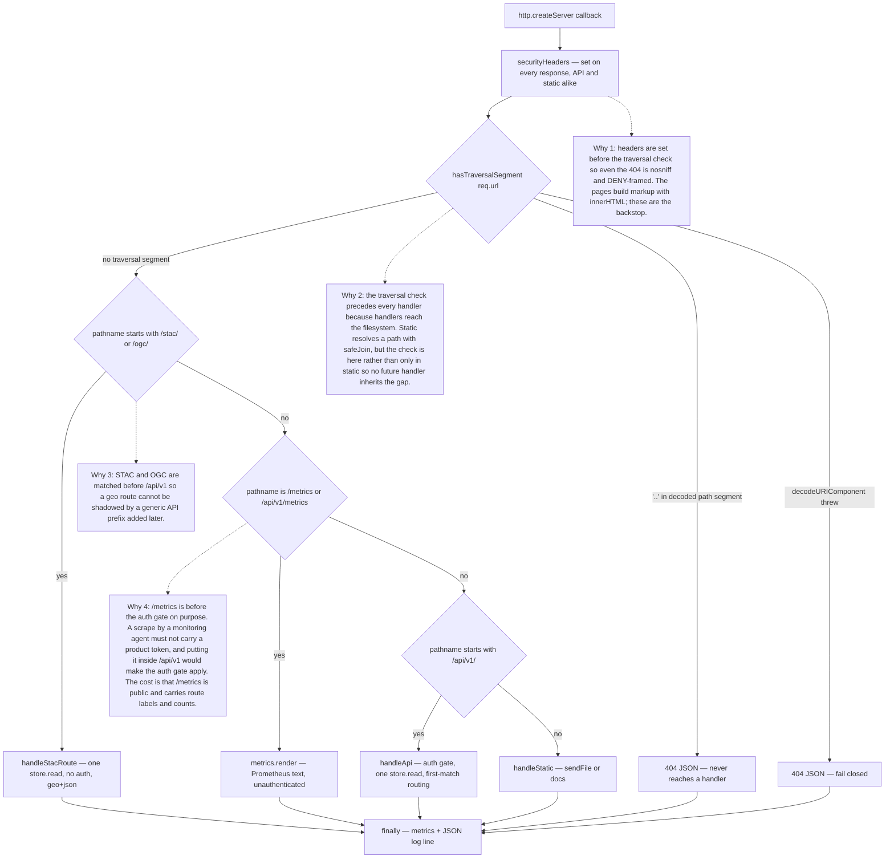
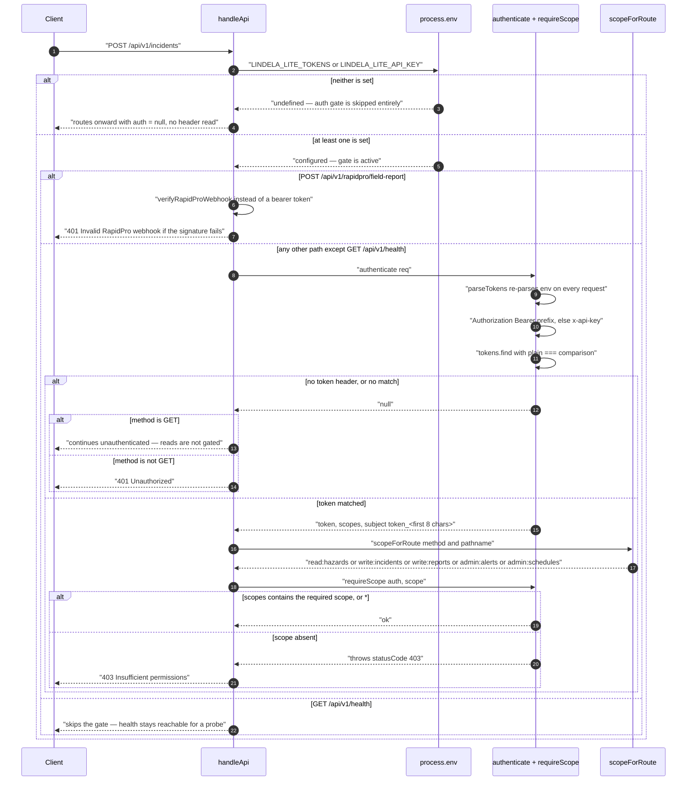
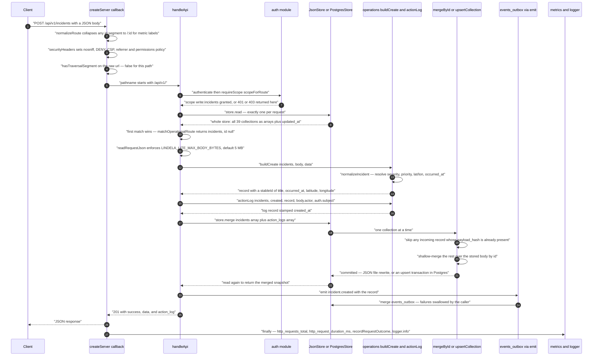
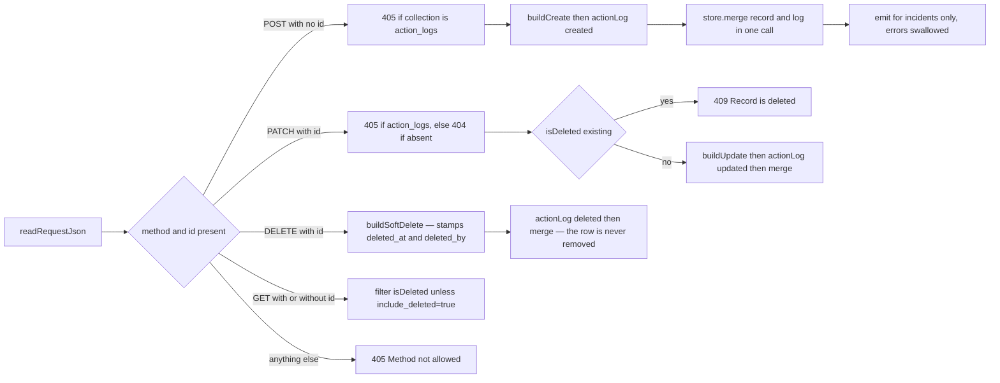

# Request lifecycle

One `http.createServer` callback serves everything: API, STAC/OGC, `/metrics`,
and the static surfaces. There is no router object, no middleware stack, and no
per-route module. Understanding a request means understanding the order of the
`if` statements in `src/server.js:84-128` and the order of the `if` statements in
`handleApi`.

Related: [system-overview.md](system-overview.md) for the process and its
boundaries, [data-model.md](data-model.md) for what `store.read()` returns,
[deployment.md](../deployment.md) for the reverse proxy in front of this.

## The one callback

`createServer` (`src/server.js:82`) resolves a store provider once, then hands
every request to a single async callback:

```js
http.createServer(async (req, res) => {
  const t = timer()
  const url = new URL(req.url, ...)
  const route = normalizeRoute(url.pathname)
  try {
    securityHeaders(res)
    ...
  } catch (error) {
    jsonResponse(res, error.statusCode || 500, { success: false, error: ... })
  } finally {
    const elapsed = t.end()
    metrics.counter('http_requests_total', {...})
    metrics.histogram('http_request_duration_ms', elapsed, {...})
    recordRequestOutcome(statusCode < 500)
    logger.info('http_request', {...})
  }
})
```

Three consequences the shape forces:

- **Metrics and logs are unconditional.** The `finally` runs on the success path,
  the 404 path, and the thrown-error path alike. A route that returns early from
  inside the `try` still produces a `http_requests_total` counter and a
  `http_request` log line. There is no code path that answers a request silently.
- **`statusCode` defaults to 500.** If a handler throws before writing a
  response, the catch block's `jsonResponse` sets it; if something returns
  without writing, `res.statusCode` stays 200 and the metric records 200. Only a
  response that is never written is recorded as a failure.
- **Thrown `statusCode` is the error contract.** Handlers signal 400/401/404/409
  by attaching `statusCode` to the `Error` and throwing
  (`Object.assign(new Error(...), { statusCode: 409 })`); the single catch block
  converts that into the JSON error envelope. Nothing else shapes an error
  response.

## Routing order

Order is load-bearing at four points. Each is annotated in the diagram.



Two of those annotations are judgement calls the code records rather than
enforces. The traversal check is **fail-closed**: `hasTraversalSegment`
(`src/server.js:2619`) catches the `decodeURIComponent` throw and returns `true`,
so a URL that will not decode is treated as a traversal attempt rather than
passed through.

## Authentication

The gate is in `handleApi` (`src/server.js:227-250`) and it is **conditional on
configuration**, not on the request. If neither `LINDELA_LITE_TOKENS` nor
`LINDELA_LITE_API_KEY` is set, the entire `/api/v1` surface is open — no header
is inspected, `auth` stays `null`, and `requireScope` is never reached.



What this means in practice:

- **Reads are not gated by possession of a token, only by scope.** An
  unauthenticated `GET` falls through with `auth === null` and is served. Only
  mutating methods without a valid token get 401.
- **The comparison is `===`, not constant-time** (`src/auth.js:31`). Token
  strings are compared in full. This is a timing side-channel in principle; the
  practical exposure depends on whether the deployment is internet-facing with
  untrusted callers, which [deployment.md](../deployment.md) addresses.
- **`parseTokens()` re-reads `process.env` and re-`JSON.parse`s on every
  request.** Token rotation takes effect without a restart, at the cost of a
  parse per request.
- **`scopeForRoute` is a prefix matcher over the raw pathname**
  (`src/auth.js:57`). `GET` short-circuits to `read:hazards`. The incident-family
  check is `pathname.includes('/incidents')`, which is loose: any path containing
  that substring on a write requires `write:incidents`.
- **`authenticate()` never sets `partner_org`.** The returned object is
  `{token, scopes, subject}`. `scopeToPartnerOrg` (`src/auth.js:85`) filters on
  `auth.partner_org` and therefore always returns its input unchanged. It is
  dead code today — see [Unresolved](#unresolved).

## A full write: `POST /api/v1/incidents`

`matchOperationalRoute` (`src/server.js:2280`) maps the first path segment
against a fixed table, so `/api/v1/incidents` resolves to
`{ collection: 'incidents', id: null }` and dispatches to
`handleOperationalRoute` (`src/server.js:1809`).



The `emit` failure is deliberately swallowed (`src/server.js:1838-1842`): an
outbox write must not be able to fail a create that already committed.

## Inside `handleApi`

After the store read, dispatch is a straight line of `if` statements. The first
one that matches wins and returns; there is no fall-through and no method table.
On the order of 90 inline `if` blocks plus eleven `match*Route()` regex
helpers.

The helper list, in the order the `if` statements that call them appear:

| Helper | Recognises |
|---|---|
| `matchWebhookRoute` | `/api/v1/webhooks/*` |
| `matchScenarioRoute` | `/api/v1/scenarios/*` — what-if perturbation runs |
| `matchParametricRoute` | `/api/v1/parametric/*` — rules, simulate, disburse |
| `matchChwRoute` | `/api/v1/chw/*` — the community-health-worker surface |
| `matchOperationalRoute` | `incidents`, `interventions`, `tasks`, `field-reports`, `response-resources`, `action-logs` |
| `matchIngestionRoute` | `/api/v1/ingest/*` — runs and schedules |
| `matchReportingRoute` | `/api/v1/reports/*`, `report-templates`, `report-schedules` |
| `matchAlertRoute` | `/api/v1/alert-rules`, `alert-events` |
| `matchTriggerRoute` | `/api/v1/trigger-protocols` |
| `matchRapidProRoute` | `/api/v1/rapidpro/*` |
| `matchWorkflowRoute` | `/api/v1/workflows` |

The operational route is the one worth reading in full, because its five methods
show the whole write pattern: `action_logs` is read-only (405 on POST, PATCH and
DELETE), `PATCH` on an already soft-deleted record is 409, and `DELETE` is a
soft delete — see [data-model.md](data-model.md#soft-delete).



**One store read per request.** `handleApi` reads once at `src/server.js:252`
and passes the resulting object to every downstream handler, including the ones
that later write. A handler that writes and then needs the post-write state
re-reads explicitly (`JsonStore.merge` and `PostgresStore.merge` both end with a
`read()`), so a write path can touch the store twice — but no route reads it a
third time, and no route reads it before the auth gate.

## Request bodies

`readRequestJson` (`src/utils.js:272`) applies two limits. `Content-Length` is
checked first so an oversized upload is rejected before buffering — but that
header can lie, so it is advisory. The authoritative check is the streaming
`size` accumulator, which throws 413 as soon as the running total exceeds
`maxBytes`. An empty body yields `{}`; invalid JSON yields 400.

The ceiling is `LINDELA_LITE_MAX_BODY_BYTES`, default 5 MB. That is sized for
bulk CSV and GeoJSON uploads through the ingestion endpoints, not for a
per-record write — a single field report that exceeded 5 MB would be
indistinguishable in the error from an oversized district upload.

## Metric labels and cardinality

`normalizeRoute` (`src/server.js:131`) rewrites the pathname for metric labels
only, collapsing UUIDs, hex blobs of 32+ characters, and integers to `/:id`:

```
/api/v1/incidents/9f1c2a3e-... -> /api/v1/incidents/:id
/api/v1/service-assets/41      -> /api/v1/service-assets/:id
```

Without this, every record id would be a distinct `route` label value and
`http_requests_total` would be an unbounded cardinality vector — the classic way
a Prometheus scrape takes down the thing it monitors. The original pathname is
still used for matching; only the label is normalised. The three regexes run in
order, so a 36-character UUID is consumed by the first rule and never reaches
the hex rule.

Note the consequence: `/api/v1/incidents/41` and `/api/v1/incidents/anythingelse`
share a label. That is the intended trade — bounded cardinality in exchange for
losing the ability to attribute a metric to a specific id, which no dashboard
does anyway.

## Static files and the docs tree

`handleStatic` resolves the path through `safeJoin`, falls back to
`public/index.html` for an unknown bare directory, and serves through `sendFile`
(`src/server.js:2540`). `sendFile` returns `false` rather than throwing when the
file cannot be read, so the caller keeps control of the 404.

Headers it sets:

| Condition | `cache-control` | Why |
|---|---|---|
| `immutable` option | `public, max-age=0, must-revalidate` | Asset filenames are not content-hashed; a long max-age pins an operator to a stale build |
| `.html`, `.webmanifest`, `sw.js` | `no-cache` | The service worker must never be stale or a fix cannot reach a device that already has the app open |
| everything else | `public, max-age=3600, must-revalidate` | Cheap revalidation against the content-hash ETag |

The ETag is a hash of the file content, not mtime, so it changes exactly when
the bytes change. `If-None-Match` gets a 304 with the full header set. Bodies
over 512 bytes of a compressible type are gzipped synchronously when the client
accepts it.

`/docs` serves the Markdown tree through the same `safeJoin` path, with the same
traversal check already applied upstream.

## What a client cannot assume

- **A 200 does not mean the write landed.** Several handlers catch and swallow
  errors from sub-operations — `emit` on incident create, the calibration
  snapshot in `refreshAnalytics`, webhook dispatch internals. The response shape
  is the only signal, and it does not enumerate what was skipped.
- **The route is a flat list, so specificity is positional.** A new `if` placed
  above an existing matcher shadows it with no warning. There is no test that
  asserts route uniqueness, because the routes are not enumerated anywhere.
- **`405` means the matcher recognised the path and rejected the method.** An
  unrecognised path is a `404`. The distinction tells a client whether it has
  the right URL, which is more useful than it sounds.
- **Errors are always the same envelope** — `{ success: false, error: string }`.
  The status code carries the rest.

## Unresolved

- ~~**`scopeToPartnerOrg` is unreachable.**~~ Resolved. `authenticate` used to
  return `{token, scopes, subject}` with nothing setting `partner_org`, so the
  guard `if (!auth?.partner_org) return records` always took the early return.
  Tokens may now carry `partner_org`, and it is read from the token definition
  into the authenticated principal (`src/auth.js`). Note this is
  per-*organisation* record filtering for organisations working the same
  response, not multi-tenancy: one deployment is one operator running one
  country programme against one database.
- **`LINDELA_LITE_MAX_BODY_BYTES` is read once, at module load.**
  `DEFAULT_MAX_BODY_BYTES` (`src/utils.js:270`) is a module-level constant
  initialised from `process.env`, so changing the variable after the process
  starts has no effect.
- **The `/metrics` exposure is intentional but unbounded in detail.** It is
  served before the auth gate and includes `http_requests_total` labels for
  every normalised route. No test asserts what it reveals.