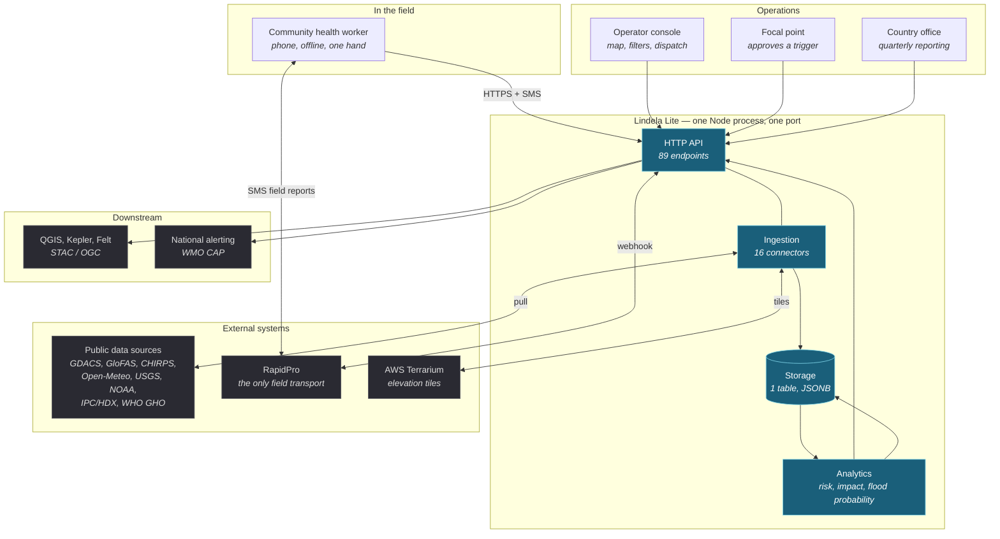
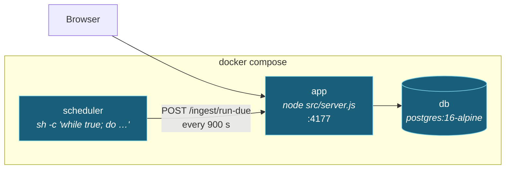
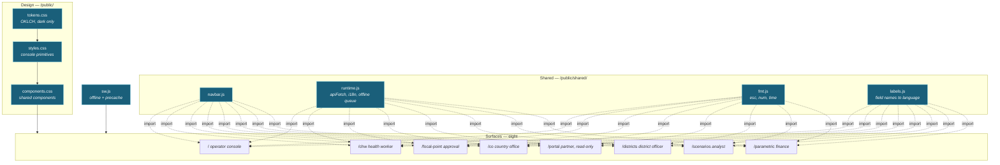

# System overview

Lindela Lite in one page: what the pieces are, what crosses each boundary, and
which decisions are load-bearing enough that changing them changes the product.

---

## 1. What the system is for

A community health worker reports a flood. An analyst sees it against the last
forty years of rainfall. A focal point decides whether pre-agreed finance
releases. A country office exports a quarterly PDF. A donor reads it.

That chain — **signal to decision to evidence** — is the whole product. Everything
below exists to make one link in that chain honest, because the chain runs on
incomplete data in places with intermittent connectivity, and a number that looks
precise but is not will be acted on as though it were.

## 2. System context

**The one thing to notice:** SMS is the only transport to the field. A community
health worker does not use the HTTP API at all in normal operation — they use
RapidPro flows, and Lindela parses the replies. Every design consequence in the
field app follows from a phone that is slow, shared, and sometimes has no signal.

## 3. Runtime topology

Three containers, no orchestrator, no broker, no cache.

The scheduler is a shell loop in a sidecar that `curl`s the API. **There is no
in-process timer anywhere in `src/`** — no `setInterval`, no cron, no worker. This
is a deliberate trade: a crash-looping app cannot also silently accumulate timers,
and a deployment that forgets a scheduled job cannot also forget its lock.

The cost is real and worth stating: if the scheduler container dies, ingestion
stops silently. Nothing in the app notices. `docs/deployment.md` covers the check.

## 4. The backend, module by module

```mermaid
flowchart TB
  subgraph entry["Entry"]
    SRV["server.js<br/><i>routing, auth, static, 89 endpoints</i>"]
  end

  subgraph acquire["Acquire"]
    ING["ingestion.js<br/><i>schedules, retries, status</i>"]
    CONN["connectors/*<br/><i>16 source adapters</i>"]
  end

  subgraph interpret["Interpret"]
    ANA["analytics.js<br/><i>flood risk, conflict risk, impact</i>"]
    FP["flood-probability.js<br/><i>empirical co-occurrence</i>"]
    DS["analytics/downscaling.js<br/><i>quantile bias correction</i>"]
    ENS["analytics/ensemble.js"]
    IMP["analytics/impact.js<br/><i>people and facilities at risk</i>"]
  end

  subgraph decide["Decide"]
    ALR["alerts.js<br/><i>rules, protocols, backtest, shadow</i>"]
    WF["workflows.js<br/><i>instances, transitions</i>"]
    EQ["equity.js"]
  end

  subgraph act["Act"]
    RP["rapidpro.js<br/><i>outbound SMS, inbound parse</i>"]
    REP["reports.js + pdf.js<br/><i>markdown and PDF</i>"]
    PARAM["parametric.js<br/><i>testnet disbursement</i>"]
    SAN["sanctions.js<br/><i>OFAC SDN screening</i>"]
  end

  subgraph govern["Govern"]
    OPS["operations.js<br/><i>soft delete, action log</i>"]
    PII["pii.js<br/><i>redaction, retention</i>"]
    LIN["lineage.js"]
    I18N["i18n.js"]
  end

  subgraph persist["Persist"]
    ST["store.js — JsonStore"]
    PG["postgres-store.js — PostgresStore"]
    SCH["schema.js<br/><i>39 collections, vocabularies</i>"]
  end

  subgraph surface["Standards"]
    STAC["stac.js"]
    CAP["cap.js"]
  end

  SRV --> ING
  ING --> CONN
  SRV --> ANA
  ANA --> FP & DS & ENS & IMP
  SRV --> ALR
  ALR --> WF & EQ
  SRV --> RP & REP & PARAM
  PARAM --> SAN
  SRV --> OPS
  OPS --> PII & LIN
  ING --> ST & PG
  ANA --> ST & PG
  ST & PG --- SCH
  SRV --> STAC & CAP
  I18N --> REP

  classDef core fill:#1a5f7a,stroke:#7fd4e8,color:#fff
  classDef data fill:#2d4a2d,stroke:#7fbf8f,color:#dfd
  class SRV,ING,ANA,ALR,RP core
  class ST,PG,SCH data
```

### Module inventory

| Module | Responsibility |
|---|---|
| `server.js` | The entire HTTP surface. Routing, auth gate, static serving, STAC/OGC. Everything else is module-private. |
| `schema.js` | The vocabulary: 39 collections, every status enum, severity weighting, region scoping. |
| `store.js` / `postgres-store.js` | One interface, two implementations. Merge semantics and the idempotency rule live in `store.js`. |
| `storage.js` / `pg0.js` | Store selection from environment, and management of an embedded Postgres for development. |
| `ingestion.js` | Source registry, policies, schedule lifecycle, health. The connectors themselves know nothing about scheduling. |
| `connectors/*` | 16 adapters. Each knows one source and one output collection. |
| `analytics.js` | Risk and impact computation, plus data quality. |
| `flood-probability.js` | The empirical rainfall–flood model, with hard refusals. |
| `alerts.js` | Rule evaluation, approval gate, trigger protocols, backtest, shadow mode. |
| `workflows.js` | Instances and transitions; the object a focal point approves. |
| `operations.js` | Soft delete and the action log. Every mutation goes through it. |
| `reports.js` / `pdf.js` | Report assembly and a dependency-free PDF writer. |
| `rapidpro.js` | The SMS transport, both directions. |
| `parametric.js` / `sanctions.js` | Testnet disbursement simulation with OFAC screening. |
| `road-access.js` / `routing.js` / `flood-depth.js` / `terrain.js` | Delivery planning, flood extent, elevation. |
| `pii.js` / `lineage.js` | Data governance. Both are partly unwired — see §7. |
| `stac.js` / `cap.js` | Standards output for GIS and national alerting consumers. |
| `observability.js` | Structured logs and in-process metrics. |
| `auth.js` | Token parsing, scope mapping. |

## 5. The frontend is eight applications, not one

They are separate applications that share a design system and a runtime library.
They are **not** one app with routes, and the separation is deliberate: the CHW
app is built for a shared phone held in one hand offline, and forcing it to match
the operator console's feature set would make it worse at the one job it has.

`shared/map-frame.js`, `basemap.js`, `seasonal.js` and `flood-bands.js` live in
`shared/` but have exactly one consumer — the console. They are factored for
testability, not reuse, and the directory name overstates the sharing.

## 6. What crosses each boundary

| Boundary | Direction | Payload | Failure mode |
|---|---|---|---|
| Browser → API | in | JSON, API key via header | Token comparison is `===`, not constant-time. |
| API → store | both | Whole-store read per request | `PostgresStore.write` rewrites the table. |
| Connector → external | out | HTTP to 16 providers | Retry is exponential; **rate limits are declared and never enforced**. |
| API → RapidPro | out | `flow_start` or `broadcast` | Webhook secret verification **passes when unset**. |
| RapidPro → API | in | SMS replies, free text | Text is parsed for ids and coordinates. |
| API → downstream | out | STAC, OGC Features, CAP XML | Standards-conformant, so a consumer trusts it. |
| Browser → external | out | AWS Terrarium tiles, keyed | Deliberately unauthenticated so a key cannot expire mid-crisis. |
| Service worker | local | Module graph + API responses | Precache is the whole module graph; omitting one entry breaks boot offline. |

The last two rows carry a shared lesson: **an unauthenticated public bucket will
not fail because someone's key expired mid-crisis**, and a precache list missing
one module is a hard boot failure, not a degradation.

## 7. Where the system does not do what its shape suggests

Recorded here because a reader who finds these by reading code will assume a bug.
Some are bugs. All are documented in the source, and three are the more serious
kind: arithmetic that looks finished and is not.

**Genuine defects**

- `alerts.js` computes `misses = samples - truePositives - falsePositives`.
  Every sample increments exactly one of TP/FP, so `misses` is identically zero
  and recall equals precision. Not commented; found by reading.
- `ingestion.js` `countRecords` omits `food_security_records` and
  `disease_observations`, so `minimum_records` never applies to `ipc_hdx` or
  `who_gho`, and `records_processed` under-reports.
- Lineage records in one ingestion batch all receive the same concatenated
  cross-source array, so `record_count` and `upstream_checksum` are identical.
- `/metrics` is served before the auth gate, so it is unauthenticated regardless
  of whether an API key is configured.
- GloFAS's feed URL serves a single-page app. The connector detects and rejects
  it, so the source reports an error and zero records rather than silently
  emptying.

**Deliberate, and stated everywhere it matters**

- The flood probability model is empirical co-occurrence, not hydrology. All
  three pilot districts refuse at `MIN_EVENTS` with the available archive, and
  the refusal is the measured ceiling rather than a temporary gap.
- Risk percentiles are sensitivity bands. They carry `calibrated_uncertainty:
  false` and were renamed from `score_p10/p50/p90` to stop reading as quantiles.
- `false_alert` is tri-state; `null` means not determined, which is what lets the
  KPI say "not yet measurable" instead of a confident zero.
- `signal-to-dispatch` is the platform's own SMS latency after a signal matches.
  It is not field-response latency, and a low number does not mean the response
  was fast.

**Scaffolded**

- DHIS2 bidirectional sync is a scaffold and returns a message saying so.
- `redactPii` is implemented and tested but never called from a request path.
- `scopeToPartnerOrg` keys on a field `authenticate()` never sets.
- Outbox dispatch, retention, KPI snapshot refresh and bias correction all
  require an explicit POST; nothing schedules them.

## 8. Continue

- [request-lifecycle.md](request-lifecycle.md) — one request, end to end
- [data-model.md](data-model.md) — what is stored and what idempotency rests on
- [ingestion.md](ingestion.md) — how external data becomes records
- [analytics-and-alerts.md](analytics-and-alerts.md) — how records become a decision
- [frontend.md](frontend.md) — the surfaces and the offline model
- [deployment.md](deployment.md) — topology, configuration, failure
- [decisions/](decisions/) — the choices that shaped all of the above